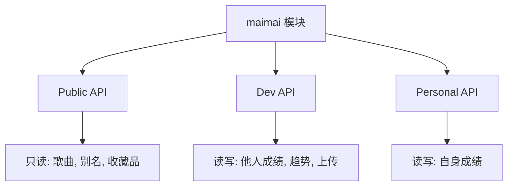

# maimai模块总览

<cite>
**本文档引用文件**
- [public.ts](file://src/apis/maimai/public.ts)
- [dev.ts](file://src/apis/maimai/dev.ts)
- [personal.ts](file://src/apis/maimai/personal.ts)
- [types/public.ts](file://src/apis/maimai/types/public.ts)
- [types/dev.ts](file://src/apis/maimai/types/dev.ts)
- [types/personal.ts](file://src/apis/maimai/types/personal.ts)
- [models.ts](file://src/apis/maimai/models.ts)
</cite>

## 目录
1. [简介](#简介)
2. [权限架构概览](#权限架构概览)
3. [公共API (Public)](#公共api-public)
4. [开发者API (Dev)](#开发者api-dev)
5. [个人API (Personal)](#个人api-personal)
6. [权限对比表](#权限对比表)
7. [核心数据模型](#核心数据模型)

## 简介

`maimai` 模块是 `lxns-rhythm-api` SDK 的核心功能载体，为用户提供了一套完整的与舞萌（maimai）游戏数据交互的接口。该模块采用清晰的三层权限架构设计，将功能划分为 **public**（公开）、**dev**（开发者）和 **personal**（个人）三个独立的 API 接口类，分别对应不同的数据访问级别和使用场景。

这种分层设计不仅保证了系统的安全性，也极大地提升了使用的灵活性。用户可以根据自身需求和拥有的凭证，选择合适的 API 进行调用。本文档旨在阐明这三层架构的关系与区别，并作为后续各 API 详细文档的导航地图，帮助用户快速定位所需功能。

## 权限架构概览

`maimai` 模块的权限控制机制完全基于不同级别的 `AccessToken` 实现。每个 API 类都封装了特定权限范围内的操作，确保用户只能访问其被授权的数据。

- **`MaimaiPublicApi`**: 提供只读的公开数据访问，无需认证或仅需基础认证。适用于获取歌曲、别名、收藏品等全局信息。
- **`MaimaiDevApi`**: 提供开发者级别的数据访问，需要更高级别的 `AccessToken`。允许通过好友码查询他人成绩、分析趋势图，并能上传成绩记录。
- **`MaimaiPersonalApi`**: 提供个人数据管理功能，需要用户的专属 `AccessToken`。专用于查询和管理认证用户自身的成绩数据。

这三者之间的关系并非简单的包含关系，而是根据数据敏感度和操作类型进行的正交划分。例如，`dev` 和 `personal` 都可以上传成绩，但 `dev` 是为他人上传（如爬虫），而 `personal` 是为自己上传。

**Diagram sources**
- [public.ts](file://src/apis/maimai/public.ts)
- [dev.ts](file://src/apis/maimai/dev.ts)
- [personal.ts](file://src/apis/maimai/personal.ts)

## 公共API (Public)

`MaimaiPublicApi` 类实现了对舞萌游戏公开数据的只读访问，是所有用户都可以安全使用的接口集合。它主要负责提供游戏的基础元数据。

### 主要功能
- **`getSongList()`**: 获取完整的歌曲列表，可按版本和是否包含谱面信息进行筛选。
- **`getSong()`**: 根据歌曲 ID 获取单首歌曲的详细信息，返回一个封装好的 `Song` 对象。
- **`getAliasList()`**: 获取所有歌曲的别名列表。
- **`getCollectionList()`**: 获取指定类型的收藏品（称号、头像、姓名框、背景）列表。
- **`getCollectionInfo()`**: 获取指定收藏品的详细信息。
- **`getCollectionGenreList()` 和 `getCollectionGenreInfo()`**: 获取收藏品的分类列表和信息。

此 API 不涉及任何用户隐私数据，因此权限要求最低，适合用于构建游戏百科、歌曲查询工具等应用。

**Section sources**
- [public.ts](file://src/apis/maimai/public.ts#L1-L103)
- [types/public.ts](file://src/apis/maimai/types/public.ts#L1-L32)

## 开发者API (Dev)

`MaimaiDevApi` 类面向开发者和数据服务提供者，提供了对玩家数据的深度访问能力。它需要一个具有“开发者”权限的 `AccessToken` 才能调用。

### 主要功能
- **`getPlayer()` / `getPlayerByQQ()`**: 通过好友码或 QQ 号获取任意玩家的基本信息。
- **`getBests()` / `getApBests()` / `getRecents()`**: 获取指定玩家的最佳成绩（Best 50）、全优成绩（AP 50）和最近游玩成绩（Recent 50）。
- **`getAllBestScores()`**: 获取指定玩家缓存的所有最佳成绩。
- **`getHeatmap()`**: 获取指定玩家的成绩上传热力图，可用于分析活跃度。
- **`getTrend()`**: 获取指定玩家的 DX Rating 历史趋势，是分析成长曲线的关键数据。
- **`getScoreHistory()`**: 获取指定玩家带有游玩时间的成绩历史记录。
- **`getCollectionProgress()`**: 查询指定玩家在某个收藏品上的进度。
- **`postScores()` / `postHtml()`**: 向系统上传指定玩家的成绩数据，这是数据同步的核心接口。

此 API 强大且敏感，主要用于构建排行榜、数据分析平台和自动化的成绩同步服务。

**Section sources**
- [dev.ts](file://src/apis/maimai/dev.ts#L1-L149)
- [types/dev.ts](file://src/apis/maimai/types/dev.ts#L1-L42)

## 个人API (Personal)

`MaimaiPersonalApi` 类专为终端用户设计，允许用户通过自己的 `AccessToken` 安全地管理个人数据。

### 主要功能
- **`getPlayer()`**: 获取当前认证用户（即自己）的玩家信息。
- **`getScores()`**: 获取当前认证用户的所有成绩记录。
- **`postScores()`**: 向系统上传当前认证用户的成绩数据。

与 `DevApi` 中的 `postScores` 不同，`PersonalApi` 的 `postScores` 方法不需要指定 `friendCode`，因为它默认操作的是当前认证的用户。这使得客户端应用能够方便地实现成绩备份和同步功能。

**Section sources**
- [personal.ts](file://src/apis/maimai/personal.ts#L1-L41)
- [types/personal.ts](file://src/apis/maimai/types/personal.ts#L1-L16)

## 权限对比表

下表清晰地对比了三种 API 的权限级别、所需凭证、主要功能和典型应用场景：

| 特性 | 公共API (Public) | 开发者API (Dev) | 个人API (Personal) |
| :--- | :--- | :--- | :--- |
| **权限级别** | 公开 (Public) | 开发者 (Developer) | 个人 (Personal) |
| **所需凭证** | 无或基础 Token | 开发者级 AccessToken | 用户级 AccessToken |
| **主要功能** | 获取歌曲、别名、收藏品等只读信息 | 通过好友码查询他人成绩、分析趋势、上传他人成绩 | 查询和管理自身成绩数据 |
| **HTTP 方法** | 仅 `GET` | `GET`, `POST` | `GET`, `POST` |
| **数据范围** | 全局、静态数据 | 他人的动态成绩数据 | 自身的动态成绩数据 |
| **典型应用场景** | 游戏百科、歌曲查询网站 | 排行榜、数据分析平台、成绩爬虫 | 成绩备份、个人数据同步、移动端App |

## 核心数据模型

所有 API 的请求和响应都基于统一的核心数据模型，定义在 `models.ts` 文件中。这些模型确保了数据结构的一致性和类型安全。

关键模型包括：
- **`Song`**: 描述一首歌曲，包含ID、标题、艺术家、流派、BPM以及各个难度的谱面信息 (`SongDifficulty`)。
- **`Player`**: 描述一位玩家，包含名称、Rating、好友码、段位、阶级以及所持有的收藏品。
- **`Score`**: 描述一次成绩，包含曲目ID、达成率、FC/FS状态、DX分数和评级等。
- **`Collection`**: 通用的收藏品模型，用于表示称号(Trophy)、头像(Icon)、姓名框(NamePlate)和背景(Frame)。

这些模型被 `public.ts`、`dev.ts` 和 `personal.ts` 中的类型定义所复用，保证了整个模块内部数据结构的高度一致性。

**Section sources**
- [models.ts](file://src/apis/maimai/models.ts#L1-L301)