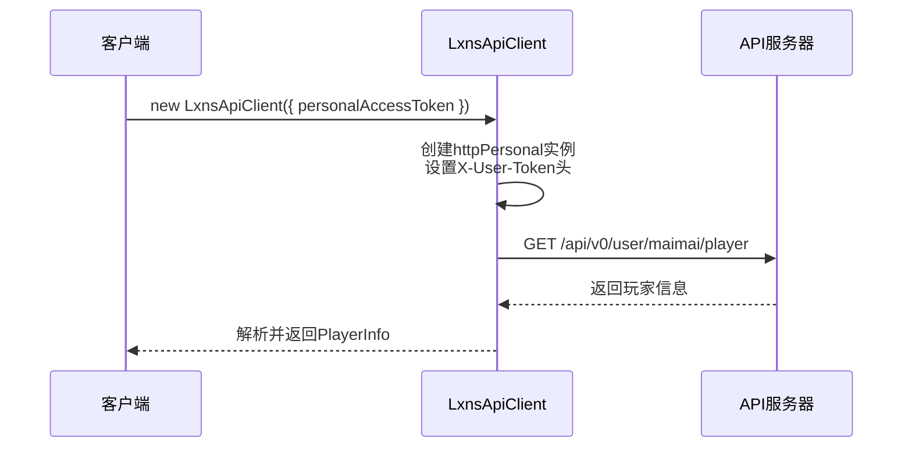
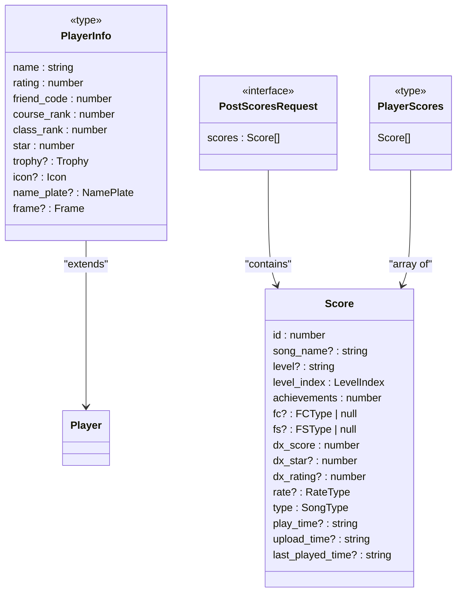

# 个人API总览

<cite>
**本文档引用文件**
- [personal.ts](file://src/apis/maimai/personal.ts)
- [types/personal.ts](file://src/apis/maimai/types/personal.ts)
- [models.ts](file://src/apis/maimai/models.ts)
- [LxnsApiCLient.ts](file://src/client/LxnsApiCLient.ts)
</cite>

## 目录
1. [简介](#简介)
2. [认证机制](#认证机制)
3. [核心接口详解](#核心接口详解)
4. [类型定义与数据结构](#类型定义与数据结构)
5. [使用示例](#使用示例)
6. [适用场景](#适用场景)
7. [安全提醒](#安全提醒)

## 简介
本模块为maimai游戏提供用户身份相关的个人数据访问接口，允许认证用户安全地获取和管理自身的成绩记录。所有操作均基于调用者本人的身份进行，确保数据隔离与隐私保护。

**Section sources**
- [personal.ts](file://src/apis/maimai/personal.ts#L1-L5)

## 认证机制
个人API必须通过`personalAccessToken`进行身份验证。该令牌需在初始化客户端时传入，并作为请求头`X-User-Token`自动附加到每个请求中。仅当提供有效令牌后，SDK才会暴露`maimai.personal`命名空间下的接口。



**Diagram sources**
- [LxnsApiCLient.ts](file://src/client/LxnsApiCLient.ts#L45-L49)
- [personal.ts](file://src/apis/maimai/personal.ts#L15-L17)

## 核心接口详解

### getPlayer 接口
获取当前登录用户的基本信息。

- **HTTP方法**: `GET`
- **路径**: `/api/v0/user/maimai/player`
- **功能**: 返回调用者的游戏昵称、DX Rating、好友码、段位等基本信息。
- **返回类型**: `PlayerInfo`

**Section sources**
- [personal.ts](file://src/apis/maimai/personal.ts#L15-L17)
- [types/personal.ts](file://src/apis/maimai/types/personal.ts#L3)

### getScores 接口
拉取当前用户的所有成绩数据。

- **HTTP方法**: `GET`
- **路径**: `/api/v0/user/maimai/player/scores`
- **功能**: 获取用户全部的历史成绩条目，包括曲目ID、达成率、FC/FS状态、DX分数等详细信息。
- **返回类型**: `PlayerScores`（Score数组）

**Section sources**
- [personal.ts](file://src/apis/maimai/personal.ts#L24-L26)
- [types/personal.ts](file://src/apis/maimai/types/personal.ts#L6)

### postScores 接口
安全提交新的成绩条目。

- **HTTP方法**: `POST`
- **路径**: `/api/v0/user/maimai/player/scores`
- **功能**: 向服务器上传一组新的成绩记录。请求体包含一个Score对象数组。
- **参数**: `scores: Score[]`
- **返回类型**: `PostScoresResponse`（通用unknown类型，具体结构由后端决定）

**Section sources**
- [personal.ts](file://src/apis/maimai/personal.ts#L34-L39)
- [types/personal.ts](file://src/apis/maimai/types/personal.ts#L9-L11)

## 类型定义与数据结构
接口的请求与响应严格遵循`types/personal.ts`中的类型定义，并依赖于`models.ts`中的基础模型。

### 主要类型映射
| 类型名称 | 来源文件 | 说明 |
|--------|--------|------|
| `PlayerInfo` | `types/personal.ts` | 玩家基本信息，继承自`Player`接口 |
| `PlayerScores` | `types/personal.ts` | 成绩列表，即`Score[]` |
| `PostScoresRequest` | `types/personal.ts` | 上传成绩的请求体结构 `{ scores: Score[] }` |
| `PostScoresResponse` | `types/personal.ts` | 上传结果，暂定为`unknown` |
| `Score` | `models.ts` | 单条成绩的完整结构，包含id, achievements, dx_score等字段 |
| `Player` | `models.ts` | 玩家实体，包含name, rating, friend_code等属性 |



**Diagram sources**
- [types/personal.ts](file://src/apis/maimai/types/personal.ts#L3-L15)
- [models.ts](file://src/apis/maimai/models.ts#L123-L282)

## 使用示例
以下代码展示了如何使用该API完成从初始化到上传成绩的完整流程。

```typescript
import { LxnsApiClient } from "lxns-rhythm-api";

// 初始化客户端并传入personalAccessToken
const client = new LxnsApiClient({
  personalAccessToken: "<your-personal-token>",
});

// 获取当前用户信息
const playerInfo = await client.maimai.personal.getPlayer();
console.log("玩家名称:", playerInfo.name);

// 获取全部已有成绩
const allScores = await client.maimai.personal.getScores();
console.log("当前共有", allScores.length, "条成绩");

// 准备新成绩数据
const newScores = [
  {
    id: 114,
    level_index: 3, // MASTER难度
    achievements: 99.99,
    fc: "fc",
    fs: "fs",
    dx_score: 123456,
    type: "standard",
    play_time: "2024-01-01T12:00:00Z",
  },
];

// 安全上传新成绩
const result = await client.maimai.personal.postScores(newScores);
console.log("上传成功:", result);
```

**Section sources**
- [LxnsApiCLient.ts](file://src/client/LxnsApiCLient.ts#L12-L78)
- [personal.ts](file://src/apis/maimai/personal.ts#L34-L39)

## 适用场景
此API特别适用于以下应用场景：
- **个人成绩同步工具**：将本地游玩数据自动同步至云端。
- **移动端记分应用**：开发手机端的成绩记录与分析App。
- **本地化数据备份系统**：定期备份用户成绩以防原始数据丢失。
- **数据分析与可视化平台**：基于历史成绩生成趋势图、统计报表等。

这些工具能够帮助玩家更好地追踪自己的进步轨迹，提升游戏体验。

## 安全提醒
`personalAccessToken`是访问您账户数据的关键凭证，请务必妥善保管：
- 切勿在公共仓库或前端代码中硬编码该令牌。
- 建议使用环境变量或安全的密钥管理系统存储。
- 一旦怀疑令牌泄露，请立即更换以防止未授权访问。
- 该API仅允许操作调用者本人的数据，但仍需警惕第三方应用的权限请求。