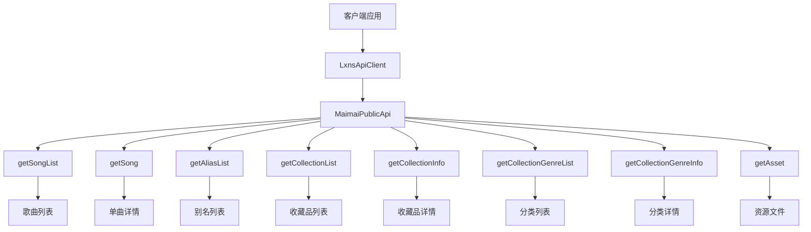
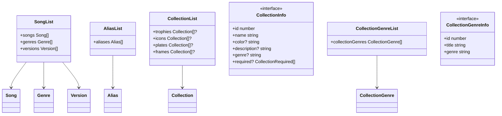

# 公共API总览

<cite>
**本文档引用文件**  
- [public.ts](file://src/apis/maimai/public.ts)
- [types/public.ts](file://src/apis/maimai/types/public.ts)
- [LxnsApiClient.ts](file://src/client/LxnsApiClient.ts)
- [models.ts](file://src/apis/maimai/models.ts)
- [Song.ts](file://src/apis/maimai/entities/Song.ts)
</cite>

## 目录
1. [简介](#简介)
2. [核心功能概览](#核心功能概览)
3. [方法详解](#方法详解)
   - [getSongList](#getSongList)
   - [getSong](#getSong)
   - [getAliasList](#getAliasList)
   - [getCollectionList](#getCollectionList)
   - [getCollectionInfo](#getCollectionInfo)
   - [getCollectionGenreList](#getCollectionGenreList)
   - [getCollectionGenreInfo](#getCollectionGenreInfo)
4. [数据契约与类型定义](#数据契约与类型定义)
5. [调用示例](#调用示例)
6. [使用场景与性能优势](#使用场景与性能优势)
7. [缓存与更新策略](#缓存与更新策略)

## 简介

maimai模块的公共API提供了一组无需身份验证即可访问的只读数据接口。该API专为获取游戏公开元数据而设计，适用于构建排行榜展示页、歌曲查询工具或资源索引站等应用场景。所有接口均通过`LxnsApiClient`实例的`maimai.public`属性访问，且不产生认证开销，具有优异的性能表现。

**Section sources**
- [public.ts](file://src/apis/maimai/public.ts#L1-L103)
- [LxnsApiClient.ts](file://src/client/LxnsApiClient.ts#L1-L81)

## 核心功能概览

公共API主要支持以下四类数据的获取：
- **歌曲信息**：包括完整歌曲列表、单曲详情及别名数据
- **收藏品信息**：涵盖奖杯(trophy)、头像(icon)、姓名框(plate)、背景(frame)等各类收藏品
- **分类信息**：提供收藏品的分类元数据
- **资产获取**：通过`getAsset`方法可下载相关资源文件

这些接口共同构成了一个完整的公开数据访问体系，满足开发者对maimai游戏基础数据的需求。



**Diagram sources**
- [public.ts](file://src/apis/maimai/public.ts#L1-L103)
- [LxnsApiClient.ts](file://src/client/LxnsApiClient.ts#L1-L81)

## 方法详解

### getSongList

获取完整的歌曲列表，包含所有歌曲的基本信息、流派(genre)和版本(version)数据。

**参数说明**
- `version`: 可选，指定要获取的版本ID，未指定时返回默认版本数据
- `notes`: 可选，是否包含谱面物量信息，未指定时遵循API默认行为

**返回结构**
返回`SongList`类型对象，包含`songs`（歌曲数组）、`genres`（流派列表）和`versions`（版本列表）三个字段。

**Section sources**
- [public.ts](file://src/apis/maimai/public.ts#L15-L22)
- [types/public.ts](file://src/apis/maimai/types/public.ts#L3-L9)

### getSong

根据歌曲ID获取特定歌曲的详细信息。

**参数说明**
- `id`: 必需，歌曲的唯一标识符（数字ID）

**返回结构**
返回封装后的`Song`实体对象。该对象不仅包含原始歌曲数据，还提供了`standard`、`dx`和`utage`三个计算属性，用于按难度类型组织谱面信息。

**Section sources**
- [public.ts](file://src/apis/maimai/public.ts#L24-L30)
- [Song.ts](file://src/apis/maimai/entities/Song.ts#L1-L65)

### getAliasList

获取所有歌曲的别名信息列表。

**参数说明**
- 无参数

**返回结构**
返回`AliasList`类型对象，包含`aliases`字段，其值为`Alias`对象数组，每个对象关联一个歌曲ID及其多个别名。

**Section sources**
- [public.ts](file://src/apis/maimai/public.ts#L32-L37)
- [types/public.ts](file://src/apis/maimai/types/public.ts#L11-L13)

### getCollectionList

获取指定类型的收藏品列表。

**参数说明**
- `collectionType`: 必需，收藏品类型，可取值为"trophy"、"icon"、"plate"或"frame"
- `options.version`: 可选，指定版本ID
- `options.required`: 可选，是否包含获取条件，默认为false

**返回结构**
返回对应类型的收藏品数组。方法内部通过映射将输入类型转换为API响应中的复数形式字段（如"trophy"→"trophies"）。

**Section sources**
- [public.ts](file://src/apis/maimai/public.ts#L39-L55)
- [types/public.ts](file://src/apis/maimai/types/public.ts#L15-L17)

### getCollectionInfo

获取指定收藏品的详细信息。

**参数说明**
- `collectionType`: 必需，收藏品类型
- `id`: 必需，收藏品ID
- `options.version`: 可选，指定版本ID

**返回结构**
返回`CollectionInfo`类型对象，即`Collection`接口的实现，包含ID、名称、描述、颜色（称号特有）和获取要求等信息。

**Section sources**
- [public.ts](file://src/apis/maimai/public.ts#L57-L67)
- [types/public.ts](file://src/apis/maimai/types/public.ts#L19-L20)

### getCollectionGenreList

获取收藏品分类的列表。

**参数说明**
- `options.version`: 可选，指定版本ID

**返回结构**
返回`CollectionGenreList`类型对象，包含`collectionGenres`字段，其值为`CollectionGenre`对象数组。

**Section sources**
- [public.ts](file://src/apis/maimai/public.ts#L79-L85)
- [types/public.ts](file://src/apis/maimai/types/public.ts#L22-L24)

### getCollectionGenreInfo

获取指定收藏品分类的详细信息。

**参数说明**
- `id`: 必需，分类ID
- `options.version`: 可选，指定版本ID

**返回结构**
返回`CollectionGenreInfo`类型对象，即`CollectionGenre`接口的实现，包含分类ID、标题和日文标题。

**Section sources**
- [public.ts](file://src/apis/maimai/public.ts#L87-L95)
- [types/public.ts](file://src/apis/maimai/types/public.ts#L26-L27)

## 数据契约与类型定义

公共API的数据交互基于严格的类型契约，所有请求和响应结构都在`types/public.ts`中明确定义，并与`models.ts`中的基础模型相链接。



**Diagram sources**
- [types/public.ts](file://src/apis/maimai/types/public.ts#L3-L27)
- [models.ts](file://src/apis/maimai/models.ts#L1-L301)

## 调用示例

以下示例展示了如何使用`LxnsApiClient`访问公共API：

```typescript
import { LxnsApiClient } from "lxns-rhythm-api";

// 创建客户端实例（无需任何token）
const client = new LxnsApiClient();

// 获取歌曲ID为114的详细信息
const song = await client.maimai.public.getSong(114);
console.log(song.title); // 输出歌曲名称
console.log(song.standard?.master); // 输出标准版大师谱面信息

// 获取所有奖杯列表
const trophies = await client.maimai.public.getCollectionList("trophy");
console.log(`共有 ${trophies.length} 个奖杯`);

// 下载歌曲封面
const jacket = await client.maimai.getAsset("jacket", 114);
await fs.writeFile("114.png", jacket);
```

**Section sources**
- [LxnsApiClient.ts](file://src/client/LxnsApiClient.ts#L1-L81)
- [README.md](file://README.md#L0-L46)

## 使用场景与性能优势

此公共API特别适合以下应用场景：
- **排行榜网站**：实时展示热门歌曲和玩家成就
- **歌曲查询工具**：提供歌曲搜索、筛选和详情查看功能
- **资源索引站**：建立完整的歌曲、收藏品数据库
- **数据分析平台**：进行游戏内容的趋势分析和统计

**性能优势**：
- 无需认证：省去了AccessToken的生成和验证过程
- 响应迅速：只读接口优化了数据查询效率
- 类型安全：完整的TypeScript类型定义减少运行时错误

**Section sources**
- [public.ts](file://src/apis/maimai/public.ts#L1-L103)
- [LxnsApiClient.ts](file://src/client/LxnsApiClient.ts#L1-L81)

## 缓存与更新策略

由于公共API提供的是相对稳定的游戏元数据，建议客户端实施适当的缓存策略以提升性能并减轻服务器负担。

- **数据更新频率**：基础数据（如歌曲列表、收藏品信息）通常在游戏版本更新时才会变化
- **推荐缓存时间**：对于非实时性要求高的场景，建议缓存1-24小时
- **缓存失效机制**：可通过监听游戏版本变更事件来主动清除缓存

开发者应注意平衡数据新鲜度与请求频率，避免不必要的重复请求。

**Section sources**
- [public.ts](file://src/apis/maimai/public.ts#L1-L103)
- [models.ts](file://src/apis/maimai/models.ts#L1-L301)