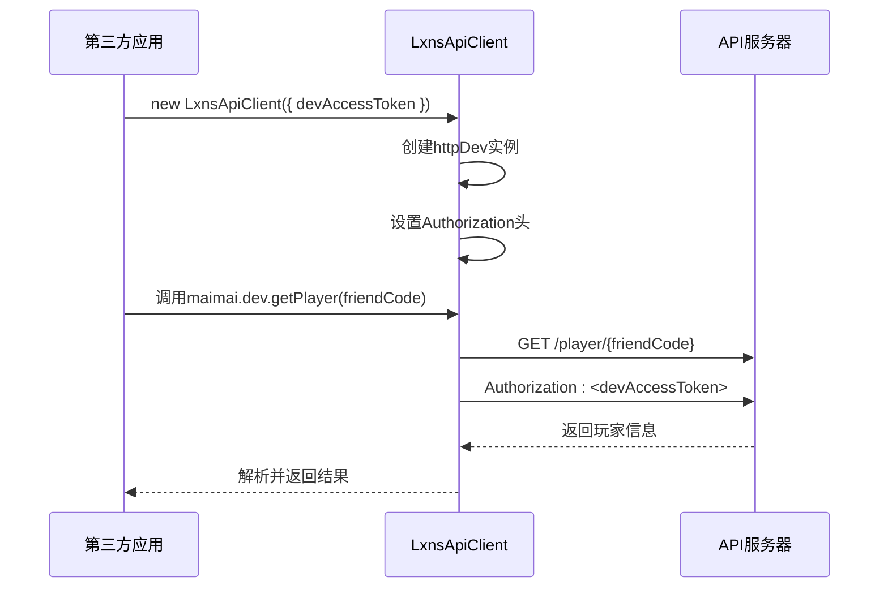
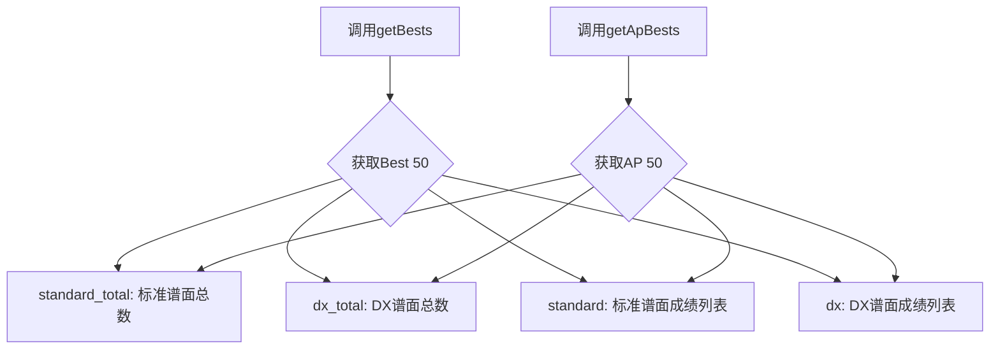
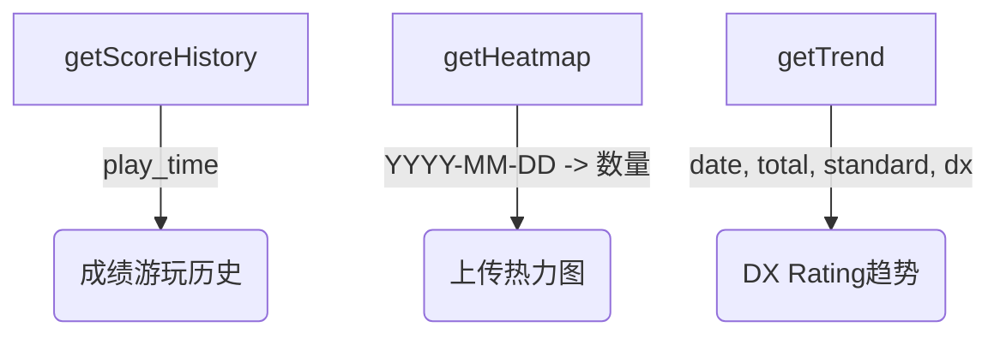
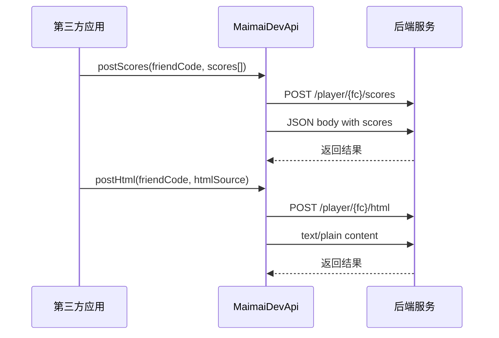

# 开发者API总览

<cite>
**本文档引用文件**
- [dev.ts](file://src/apis/maimai/dev.ts)
- [types/dev.ts](file://src/apis/maimai/types/dev.ts)
- [models.ts](file://src/apis/maimai/models.ts)
- [LxnsApiCLient.ts](file://src/client/LxnsApiCLient.ts)
- [README.md](file://README.md)
</cite>

## 目录
1. [简介](#简介)
2. [权限与认证机制](#权限与认证机制)
3. 用户管理接口
   - [getPlayer（通过好友码查询玩家）](#getplayer通过好友码查询玩家)
   - [getPlayerByQQ（通过QQ号查找玩家）](#getplayerbyqq通过qq号查找玩家)
   - [postPlayer（注册新玩家）](#postplayer注册新玩家)
4. 成绩分析接口
   - [getBests 与 getApBests](#getbests-与-getapbests)
   - [getRecents 与 getAllBestScores](#getrecents-与-getallbestscores)
   - [getScoreHistory、getHeatmap 与 getTrend](#getscorehistorygetheatmap-与-gettrend)
5. 收藏进度追踪
   - [getCollectionProgress 接口](#getcollectionprogress-接口)
6. 批量成绩上传
   - [postScores 与 postHtml 接口](#postscores-与-posthtml-接口)
7. 输入输出类型定义
   - [参数约束与数据格式](#参数约束与数据格式)
8. 典型使用案例
   - [构建成绩分析平台](#构建成绩分析平台)
   - [自动化数据采集服务](#自动化数据采集服务)
9. 权限边界与滥用防范
   - [安全使用指南](#安全使用指南)

## 简介

开发者API为第三方应用提供了对maimai游戏数据的高级访问能力，支持跨用户数据查询与批量操作。该API基于路径风格设计，不使用查询参数，确保了接口的一致性与可预测性。所有接口调用均需提供有效的`devAccessToken`进行身份验证，以保障数据安全与系统稳定。

本API封装在`MaimaiDevApi`类中，通过`LxnsApiClient`客户端实例化后即可使用。开发者可通过此API实现玩家信息获取、成绩数据分析、收藏品进度追踪以及批量成绩上传等功能，适用于构建成绩分析平台、自动化数据采集服务等应用场景。

**Section sources**
- [dev.ts](file://src/apis/maimai/dev.ts#L1-L10)
- [LxnsApiCLient.ts](file://src/client/LxnsApiCLient.ts#L45-L80)

## 权限与认证机制

开发者API要求调用方必须提供有效的`devAccessToken`才能访问。当在`LxnsApiClient`构造函数中传入`devAccessToken`时，SDK会在`maimai.dev`命名空间下启用开发者接口，并自动设置`Authorization`请求头。



**Diagram sources**
- [LxnsApiCLient.ts](file://src/client/LxnsApiCLient.ts#L0-L43)
- [dev.ts](file://src/apis/maimai/dev.ts#L1-L10)

**Section sources**
- [LxnsApiCLient.ts](file://src/client/LxnsApiCLient.ts#L0-L80)
- [README.md](file://README.md#L50-L70)

## 用户管理接口

### getPlayer（通过好友码查询玩家）

`getPlayer`接口允许开发者通过玩家的好友码查询其详细信息。该接口是获取玩家基础数据的主要方式之一，返回包含玩家名称、DX Rating、段位ID等信息的完整对象。

```typescript
async getPlayer(friendCode: number): Promise<Dev.PlayerInfo>
```

此接口适用于需要根据好友码定位特定玩家的场景，如好友关系分析、排行榜生成等。

**Section sources**
- [dev.ts](file://src/apis/maimai/dev.ts#L15-L20)

### getPlayerByQQ（通过QQ号查找玩家）

`getPlayerByQQ`接口提供了通过QQ号码查找玩家的能力。这一功能特别适用于已知玩家社交账号但不知晓游戏内标识的集成场景。

```typescript
async getPlayerByQQ(qq: number): Promise<Dev.PlayerInfo>
```

该接口增强了用户识别的灵活性，使得跨平台用户关联成为可能。

**Section sources**
- [dev.ts](file://src/apis/maimai/dev.ts#L22-L27)

### postPlayer（注册新玩家）

`postPlayer`接口用于创建或修改玩家信息。开发者可以提交包含玩家基本信息的对象来完成注册或更新操作。

```typescript
async postPlayer(body: Player): Promise<Dev.PlayerInfo>
```

此接口支持玩家数据的写入，是构建用户同步服务的关键组件。

**Section sources**
- [dev.ts](file://src/apis/maimai/dev.ts#L12-L14)

## 成绩分析接口

### getBests 与 getApBests

`getBests`和`getApBests`接口分别用于获取玩家的最佳50成绩（Best 50）和全完美50成绩（AP 50）。两者返回结构相同，均为包含标准谱面（standard）和DX谱面（dx）的成绩列表。



**Diagram sources**
- [dev.ts](file://src/apis/maimai/dev.ts#L29-L38)
- [types/dev.ts](file://src/apis/maimai/types/dev.ts#L6-L11)

**Section sources**
- [dev.ts](file://src/apis/maimai/dev.ts#L29-L38)
- [types/dev.ts](file://src/apis/maimai/types/dev.ts#L6-L11)

### getRecents 与 getAllBestScores

`getRecents`接口返回最近50次游玩记录，仅在增量爬取可用时有效。而`getAllBestScores`则获取玩家缓存的所有最佳成绩，采用简化版成绩结构。

```typescript
// RecentList 结构
type RecentList = Models.Score[];

// BestScoreList 结构
type BestScoreList = Models.SimpleScore[];
```

前者适合实时活动监控，后者适用于全面成绩分析。

**Section sources**
- [dev.ts](file://src/apis/maimai/dev.ts#L40-L51)
- [types/dev.ts](file://src/apis/maimai/types/dev.ts#L13-L16)

### getScoreHistory、getHeatmap 与 getTrend

这三个接口提供了多维度的成绩分析能力：
- `getScoreHistory`：返回带有游玩时间的成绩记录
- `getHeatmap`：以日期为键的成绩上传数量统计
- `getTrend`：DX Rating随时间变化的趋势数据



**Diagram sources**
- [dev.ts](file://src/apis/maimai/dev.ts#L53-L75)
- [types/dev.ts](file://src/apis/maimai/types/dev.ts#L18-L24)

**Section sources**
- [dev.ts](file://src/apis/maimai/dev.ts#L53-L75)
- [types/dev.ts](file://src/apis/maimai/types/dev.ts#L18-L24)

## 收藏进度追踪

### getCollectionProgress 接口

`getCollectionProgress`接口用于查询玩家特定收藏品的完成进度。通过指定好友码、收藏品类型和ID，可获取详细的收集状态。

```typescript
async getCollectionProgress(
  friendCode: number,
  collectionType: "trophy" | "icon" | "plate" | "frame",
  collectionId: number
): Promise<Dev.CollectionProgress>
```

该接口返回的`CollectionProgress`包含收藏品ID、名称、说明及完成要求等信息，支持深度收藏成就分析。

**Section sources**
- [dev.ts](file://src/apis/maimai/dev.ts#L77-L90)
- [types/dev.ts](file://src/apis/maimai/types/dev.ts#L26-L27)

## 批量成绩上传

### postScores 与 postHtml 接口

`postScores`和`postHtml`接口支持批量上传玩家成绩，满足高效数据同步需求。



**Diagram sources**
- [dev.ts](file://src/apis/maimai/dev.ts#L92-L115)
- [types/dev.ts](file://src/apis/maimai/types/dev.ts#L29-L32)

**Section sources**
- [dev.ts](file://src/apis/maimai/dev.ts#L92-L115)
- [types/dev.ts](file://src/apis/maimai/types/dev.ts#L29-L32)

## 输入输出类型定义

### 参数约束与数据格式

所有接口的输入输出类型均在`types/dev.ts`中明确定义，确保类型安全。关键类型包括：

| 类型 | 描述 | 关键字段 |
|------|------|----------|
| PlayerInfo | 玩家信息 | name, rating, friend_code |
| Bests/ApBests | 最佳成绩 | standard, dx, *_total |
| Score | 成绩详情 | id, achievements, fc, fs, dx_score |
| SimpleScore | 简化成绩 | song_name, level, rate |
| Heatmap | 热力图数据 | Record<string, number> |
|