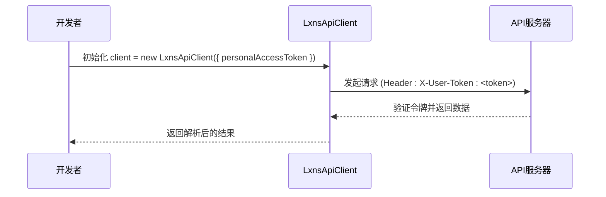

# 个人API参考

<cite>
**本文档中引用的文件**
- [personal.ts](file://src/apis/maimai/personal.ts)
- [types/personal.ts](file://src/apis/maimai/types/personal.ts)
- [models.ts](file://src/apis/maimai/models.ts)
- [LxnsApiClient.ts](file://src/client/LxnsApiClient.ts)
</cite>

## 目录
1. [简介](#简介)
2. [认证与访问控制](#认证与访问控制)
3. [核心接口方法](#核心接口方法)
4. [数据模型详解](#数据模型详解)
5. [完整使用流程示例](#完整使用流程示例)
6. [注意事项与最佳实践](#注意事项与最佳实践)

## 简介
`maimai.personal` 命名空间提供了一组专为已认证个人用户设计的API接口，允许开发者安全地获取和更新当前登录用户的游戏数据。该接口集通过 `personalAccessToken` 进行身份验证，确保所有操作仅限于当前用户自身数据，无法访问或修改其他用户的信息。主要功能包括获取玩家基本信息、检索全部成绩记录以及上传新的成绩数据。

**Section sources**
- [personal.ts](file://src/apis/maimai/personal.ts#L1-L5)

## 认证与访问控制
调用 `maimai.personal` 接口必须在初始化 `LxnsApiClient` 时提供有效的 `personalAccessToken`。SDK会自动在HTTP请求头中添加 `"X-User-Token"` 字段进行身份验证。只有成功通过验证的请求才能访问相关资源。此机制确保了数据的安全性和隐私性，所有操作均被限制在当前认证用户的数据范围内。



**Diagram sources**
- [LxnsApiClient.ts](file://src/client/LxnsApiClient.ts#L45-L80)
- [personal.ts](file://src/apis/maimai/personal.ts#L1-L5)

## 核心接口方法

### getPlayer 方法
用于获取当前登录用户的基本信息。

- **HTTP方法**: GET
- **路径**: `/api/v0/user/maimai/player`
- **用途**: 获取当前用户的昵称、DX Rating、好友码等核心信息。
- **返回类型**: `PlayerInfo` (即 `Player` 模型)

**Section sources**
- [personal.ts](file://src/apis/maimai/personal.ts#L10-L14)

### getScores 方法
用于获取当前用户的所有成绩记录，并支持按条件过滤。

- **HTTP方法**: GET
- **路径**: `/api/v0/user/maimai/player/scores`
- **用途**: 检索用户完整的成绩列表。
- **返回类型**: `PlayerScores` (即 `Score[]`)
- **过滤参数**: 虽然代码中未直接体现，但可通过扩展查询参数实现按难度（LevelIndex）、等级（如 "14+"）等条件筛选。

**Section sources**
- [personal.ts](file://src/apis/maimai/personal.ts#L16-L20)

### postScores 方法
用于上传一个或多个成绩记录到服务器。

- **HTTP方法**: POST
- **路径**: `/api/v0/user/maimai/player/scores`
- **请求体**: `PostScoresRequest`，包含一个 `scores` 数组。
- **数据校验规则**:
  - `id` (曲目ID) 必须为有效数字。
  - `achievements` (达成率) 应为 0 到 101 之间的数值。
  - `dx_score` (DX分数) 必须与达成率计算相符。
  - `level_index` 和 `type` 需与曲库中的定义匹配。
- **幂等性**: 同一成绩多次上传应被视为同一操作，避免重复计分。
- **成功响应**: 返回 `PostScoresResponse` 类型，目前定义为 `unknown`，表示上传成功的确认信号。

**Section sources**
- [personal.ts](file://src/apis/maimai/personal.ts#L22-L32)
- [types/personal.ts](file://src/apis/maimai/types/personal.ts#L7-L11)

## 数据模型详解

### Player 模型
代表玩家的核心信息。

| 字段 | 类型 | 说明 |
|------|------|------|
| name | string | 游戏内名称 |
| rating | number | 玩家 DX Rating |
| friend_code | number | 好友码 |
| course_rank | number | 段位 ID |
| class_rank | number | 阶级 ID |
| star | number | 搭档觉醒数 |
| trophy | Trophy? | 称号信息 |
| icon | Icon? | 头像信息 |
| name_plate | NamePlate? | 姓名框信息 |
| frame | Frame? | 背景信息 |

**Section sources**
- [models.ts](file://src/apis/maimai/models.ts#L123-L140)

### Score 模型
代表一条成绩记录。

| 字段 | 类型 | 说明 |
|------|------|------|
| id | number | 曲目 ID |
| song_name | string? | 曲名（仅获取时返回） |
| level | string? | 难度标级，如 "14+"（仅获取时返回） |
| level_index | LevelIndex | 难度枚举值 |
| achievements | number | 达成率 |
| fc | FCType? | FULL COMBO 类型 |
| fs | FSType? | FULL SYNC 类型 |
| dx_score | number | DX 分数 |
| dx_star | number? | DX 星级（最大5星） |
| dx_rating | number? | 计算出的 DX Rating（仅获取时返回） |
| rate | RateType? | 评级类型（仅获取时返回） |
| type | SongType | 谱面类型 ("standard", "dx", "utage") |
| play_time | string? | 游玩的 UTC 时间 |
| upload_time | string? | 成绩同步时间 |
| last_played_time | string? | 谱面最后游玩时间 |

**Section sources**
- [models.ts](file://src/apis/maimai/models.ts#L230-L282)

## 完整使用流程示例
以下是一个从获取现有成绩到上传新增成绩的完整代码流程：

```ts
import { LxnsApiClient } from "lxns-rhythm-api";

// 1. 初始化客户端
const client = new LxnsApiClient({
  personalAccessToken: "<your-personal-token>"
});

// 2. 获取当前用户信息
const player = await client.maimai.personal.getPlayer();
console.log("玩家姓名:", player.name);

// 3. 获取所有现有成绩
const scores = await client.maimai.personal.getScores();
console.log("现有成绩数量:", scores.length);

// 4. 准备新成绩数据
const newScore = {
  id: 114, // 示例曲目ID
  level_index: 3, // MASTER 难度
  achievements: 99.5,
  fc: "fc",
  fs: null,
  dx_score: 950000,
  type: "dx" as const,
  play_time: new Date().toISOString().slice(0, 16) + "Z"
};

// 5. 上传新成绩
try {
  const result = await client.maimai.personal.postScores([newScore]);
  console.log("成绩上传成功");
} catch (error) {
  console.error("上传失败:", error);
}
```

**Section sources**
- [personal.ts](file://src/apis/maimai/personal.ts#L10-L32)
- [README.md](file://README.md#L25-L35)

## 注意事项与最佳实践
- **数据一致性**: 在上传成绩前，建议先调用 `getScores` 获取最新状态，避免覆盖或冲突。
- **幂等性处理**: 设计上传逻辑时应考虑网络重试场景，确保相同成绩不会导致数据异常增长。
- **字段完整性**: 上传 `Score` 对象时，`song_name`, `level`, `rate`, `dx_rating` 等字段可省略，服务器会根据 `id` 和 `achievements` 自动填充。
- **错误处理**: 应捕获 `postScores` 的潜在异常，如网络错误或数据校验失败。
- **隐私保护**: `personalAccessToken` 应妥善保管，切勿在客户端代码中硬编码或泄露。

**Section sources**
- [personal.ts](file://src/apis/maimai/personal.ts#L22-L32)
- [models.ts](file://src/apis/maimai/models.ts#L230-L282)