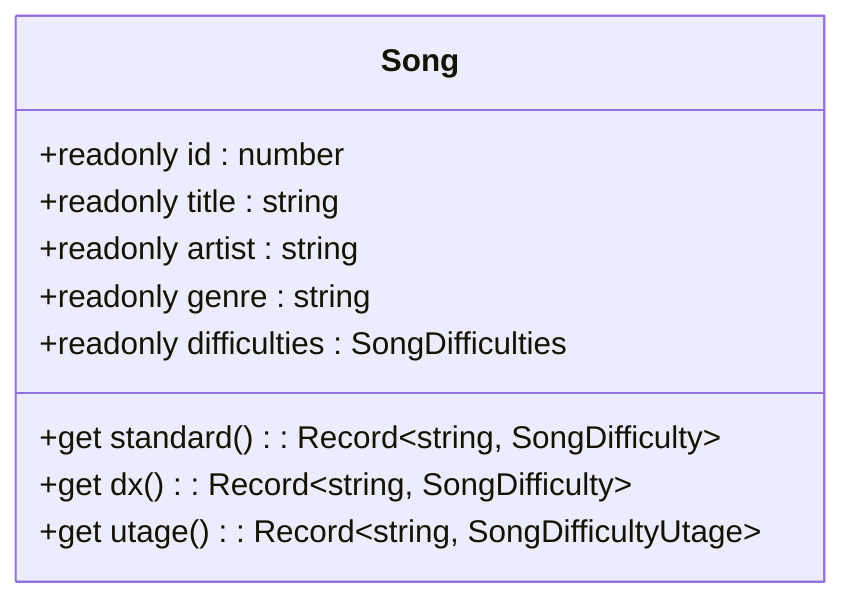
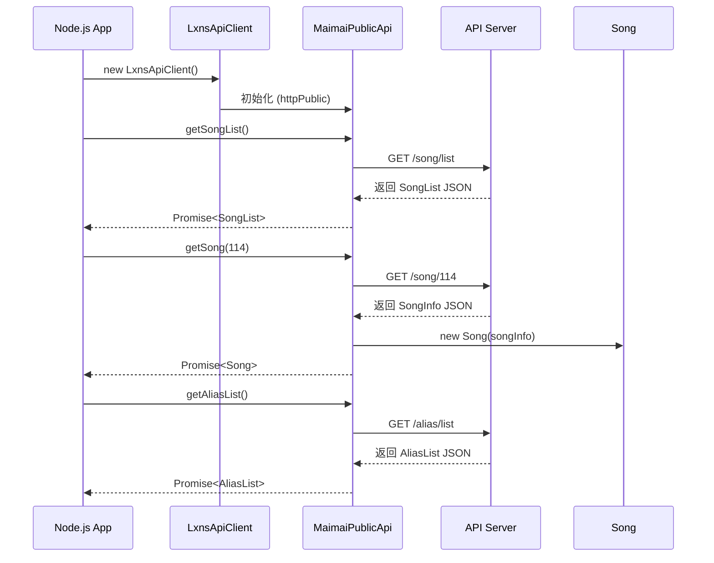

<cite>
**本文档中引用的文件**
- [public.ts](file://src/apis/maimai/public.ts)
- [types/public.ts](file://src/apis/maimai/types/public.ts)
- [models.ts](file://src/apis/maimai/models.ts)
- [Song.ts](file://src/apis/maimai/entities/Song.ts)
- [LxnsApiCLient.ts](file://src/client/LxnsApiCLient.ts)
- [types.ts](file://src/client/types.ts)
</cite>

# 歌曲相关接口

## 目录
1. [简介](#简介)
2. [核心接口概览](#核心接口概览)
3. [getSongList: 获取歌曲列表](#getsonglist-获取歌曲列表)
4. [getSong: 获取歌曲详情](#getsong-获取歌曲详情)
5. [getAliasList: 获取别名列表](#getaliaslist-获取别名列表)
6. [Song实体类与便捷访问](#song实体类与便捷访问)
7. [调用示例](#调用示例)
8. [应用场景](#应用场景)

## 简介

本文档详细说明了 `maimai.public` 命名空间下用于访问舞萌（maimai）歌曲数据的公开API接口。这些接口无需认证，适用于构建各类第三方工具，如歌曲浏览器、难度筛选器和别名搜索应用。文档将深入解析 `getSongList`、`getSong` 和 `getAliasList` 三个核心方法的使用方式、参数约束及响应结构。

**Section sources**
- [public.ts](file://src/apis/maimai/public.ts#L1-L103)

## 核心接口概览

`MaimaiPublicApi` 类提供了对舞萌游戏数据的公共访问。其主要方法如下：

| 方法 | HTTP路径 | 描述 |
| :--- | :--- | :--- |
| `getSongList()` | `GET /song/list` | 获取所有歌曲的基础信息列表，支持版本过滤。 |
| `getSong(id)` | `GET /song/:id` | 根据歌曲ID获取完整的歌曲详情，包括难度分布和关联别名。 |
| `getAliasList()` | `GET /alias/list` | 获取全局的歌曲别名映射数据。 |

这些接口返回的数据均基于定义在 `models.ts` 中的TypeScript接口，确保了类型安全。

**Section sources**
- [public.ts](file://src/apis/maimai/public.ts#L16-L38)
- [types/public.ts](file://src/apis/maimai/types/public.ts#L0-L31)
- [models.ts](file://src/apis/maimai/models.ts#L0-L301)

## getSongList: 获取歌曲列表

此方法用于获取所有歌曲的基础信息列表。

### 接口详情
- **HTTP方法**: GET
- **路径**: `/api/v0/maimai/song/list`
- **所属方法**: `MaimaiPublicApi.getSongList(version?: number, notes?: boolean)`

### 请求参数
| 参数 | 类型 | 必需 | 描述 |
| :--- | :--- | :--- | :--- |
| `version` | `number` | 否 | 指定要查询的版本号。不传则返回所有版本的歌曲。 |
| `notes` | `boolean` | 否 | 是否在响应中包含详细的谱面物量信息（如Tap、Hold等）。不传则遵循API默认行为。 |

### 响应体 (SongList)
响应体是一个 `SongList` 对象，其结构如下：
```typescript
interface SongList {
  songs: Song[];     // 歌曲数组
  genres: Genre[];   // 流派分类数组
  versions: Version[]; // 版本信息数组
}
```
其中 `Song` 的基础属性包括 `id`, `title`, `artist`, `genre`, `bpm`, `version` 等。

**Section sources**
- [public.ts](file://src/apis/maimai/public.ts#L16-L24)
- [types/public.ts](file://src/apis/maimai/types/public.ts#L3-L9)
- [models.ts](file://src/apis/maimai/models.ts#L129-L188)

## getSong: 获取歌曲详情

此方法根据歌曲ID返回该歌曲的完整详细信息。

### 接口详情
- **HTTP方法**: GET
- **路径**: `/api/v0/maimai/song/:id`
- **所属方法**: `MaimaiPublicApi.getSong(id: number)`

### 请求参数
| 参数 | 类型 | 必需 | 描述 |
| :--- | :--- | :--- | :--- |
| `id` | `number` | 是 | 要查询的歌曲ID。 |

### 响应体 (SongDetail)
该方法返回一个经过封装的 `Song` 实体类实例，其数据来源于 `SongInfo` 类型。
```typescript
type SongInfo = Models.Song;
```
除了基础信息外，`Song` 实体还包含了完整的难度信息 `difficulties`，其结构为：
```typescript
interface SongDifficulties {
  standard: SongDifficulty[]; // 标准版（绿谱）难度数组
  dx: SongDifficulty[];       // DX版（红谱）难度数组
  utage?: SongDifficultyUtage[]; // 宴会场（紫谱）难度数组（可选）
}

interface SongDifficulty {
  type: "standard" | "dx" | "utage"; // 谱面类型
  difficulty: LevelIndex;           // 难度索引 (0-4)
  level: string;                    // 难度等级 (如 "14+")
  level_value: number;              // 难度数值
  note_designer: string;            // 谱师
  version: number;                  // 所属版本
  notes?: Notes;                    // 谱面物量信息
}
```

**Section sources**
- [public.ts](file://src/apis/maimai/public.ts#L27-L34)
- [types/public.ts](file://src/apis/maimai/types/public.ts#L12-L14)
- [models.ts](file://src/apis/maimai/models.ts#L67-L128)

## getAliasList: 获取别名列表

此方法提供全局的歌曲别名映射数据。

### 接口详情
- **HTTP方法**: GET
- **路径**: `/api/v0/maimai/alias/list`
- **所属方法**: `MaimaiPublicApi.getAliasList()`

### 请求参数
无。

### 响应体 (AliasItem)
响应体是一个 `AliasList` 对象。
```typescript
interface AliasList {
  aliases: Alias[];
}

interface Alias {
  song_id: number;      // 关联的歌曲ID
  aliases: string[];    // 该歌曲的所有别名字符串数组
}
```
此数据可用于实现通过非官方名称搜索歌曲的功能。

**Section sources**
- [public.ts](file://src/apis/maimai/public.ts#L36-L42)
- [types/public.ts](file://src/apis/maimai/types/public.ts#L17-L20)
- [models.ts](file://src/apis/maimai/models.ts#L188-L192)

## Song实体类与便捷访问

`getSong` 方法返回的不是一个原始的JSON对象，而是一个 `Song` 类的实例。这个实体类封装了原始数据，并提供了计算属性来简化对不同版本成绩数据的访问。

### 计算属性
`Song` 类定义了三个关键的getter属性：`standard`、`dx` 和 `utage`。



**Diagram sources**
- [Song.ts](file://src/apis/maimai/entities/Song.ts#L0-L65)

#### 功能说明
- **目的**: 将 `difficulties.standard` 这样的数组转换为以难度名称为键的对象，便于直接访问。
- **转换逻辑**: 内部的 `convertDifficulty` 函数会将 `LevelIndex` 枚举值（0-4）映射为对应的字符串键：`basic`, `advanced`, `expert`, `master`, `remaster`。
- **使用示例**:
  ```typescript
  const song = await client.maimai.public.getSong(114);
  console.log(song.title); // 输出歌曲名
  console.log(song.standard?.master); // 直接访问标准版的Master难度信息
  console.log(song.dx?.expert); // 直接访问DX版的Expert难度信息
  ```
  如果某个版本或难度不存在，相应的属性会返回 `null`。

**Section sources**
- [Song.ts](file://src/apis/maimai/entities/Song.ts#L0-L65)
- [models.ts](file://src/apis/maimai/models.ts#L67-L128)

## 调用示例

以下是在Node.js环境中使用 `LxnsApiClient` 调用这些公开接口的示例代码。



**Diagram sources**
- [LxnsApiCLient.ts](file://src/client/LxnsApiCLient.ts#L0-L81)
- [public.ts](file://src/apis/maimai/public.ts#L16-L42)

### 示例代码
```typescript
import { LxnsApiClient } from "lxns-rhythm-api";

// 创建客户端实例（无需token即可使用public API）
const client = new LxnsApiClient();

// 获取所有歌曲列表
const songList = await client.maimai.public.getSongList();
console.log(`共找到 ${songList.songs.length} 首歌曲`);

// 获取ID为114的歌曲详情
const song = await client.maimai.public.getSong(114);
if (song) {
  console.log(`歌曲: ${song.title}`);
  if (song.standard) {
    console.log(`标准版大师谱等级: ${song.standard.master.level}`);
  }
  if (song.dx) {
    console.log(`DX版专家谱等级: ${song.dx.expert.level}`);
  }
}

// 获取所有别名
const aliasList = await client.maimai.public.getAliasList();
const song114Aliases = aliasList.aliases.find(a => a.song_id === 114)?.aliases || [];
console.log(`ID 114的别名: ${song114Aliases.join(', ')}`);
```

