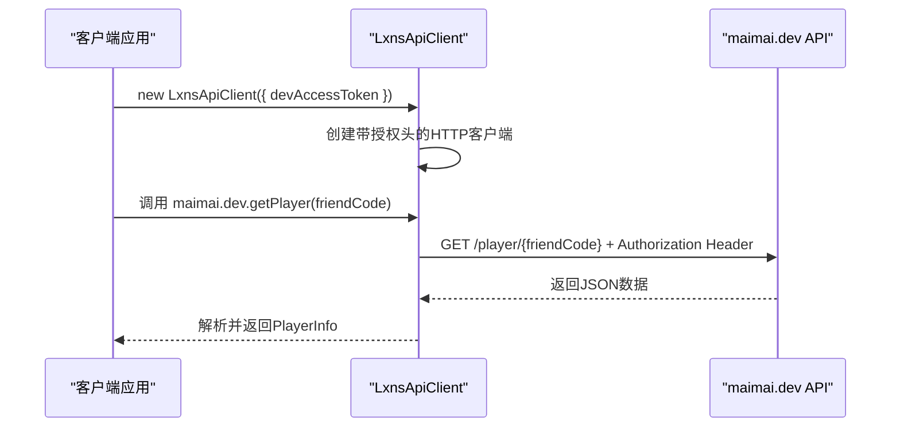

# 开发者API参考

<cite>
**本文档中引用的文件**
- [dev.ts](file://src/apis/maimai/dev.ts)
- [models.ts](file://src/apis/maimai/models.ts)
- [types/dev.ts](file://src/apis/maimai/types/dev.ts)
- [LxnsApiClient.ts](file://src/client/LxnsApiClient.ts)
- [types.ts](file://src/client/types.ts)
</cite>

## 目录
1. [简介](#简介)
2. [认证要求](#认证要求)
3. [核心端点参考](#核心端点参考)
4. [数据上传功能](#数据上传功能)
5. [Rating趋势分析](#rating趋势分析)
6. [代码示例](#代码示例)
7. [错误处理建议](#错误处理建议)

## 简介
本技术文档为 `maimai.dev` 命名空间下的开发者级API提供全面的参考。该API通过轻量级TypeScript SDK `lxns-rhythm-api` 提供，允许开发者查询玩家信息、成绩数据、收藏品进度，并支持成绩数据的上传与同步。

**Section sources**
- [dev.ts](file://src/apis/maimai/dev.ts#L1-L10)
- [README.md](file://README.md#L1-L10)

## 认证要求
调用所有开发者API端点必须在HTTP请求头中提供有效的 `devAccessToken`。此令牌需在初始化 `LxnsApiClient` 时传入配置对象。SDK会自动将令牌附加到授权头（Authorization header）上。



**Diagram sources**
- [LxnsApiClient.ts](file://src/client/LxnsApiClient.ts#L40-L50)
- [dev.ts](file://src/apis/maimai/dev.ts#L1-L10)

## 核心端点参考
以下表格详细列出了所有可用的开发者API端点，包括其功能、参数和返回值。

| 端点 | 功能描述 | 参数 | 返回值 |
| :--- | :--- | :--- | :--- |
| `getPlayer(friendCode)` | 通过好友码查询玩家信息 | `friendCode`: 数字类型的好友码 | `PlayerInfo` 对象，包含玩家名称、Rating、段位等信息 |
| `getPlayerByQQ(qq)` | 通过QQ号查询玩家信息 | `qq`: 数字类型的QQ号 | `PlayerInfo` 对象 |
| `postPlayer(body)` | 创建或修改玩家信息 | `body`: 包含玩家信息的 `Player` 对象 | 成功后返回更新的 `PlayerInfo` |
| `getBests(friendCode)` | 获取玩家的Best 50成绩（标准35首+DX 15首） | `friendCode`: 玩家好友码 | `Bests` 对象，包含 `standard_total`, `dx_total`, `standard` 和 `dx` 成绩列表 |
| `getApBests(friendCode)` | 获取玩家的全连（AP）最佳50成绩 | `friendCode`: 玩家好友码 | `ApBests` 对象，结构同 `Bests` |
| `getRecents(friendCode)` | 获取玩家最近游玩的50条成绩记录 | `friendCode`: 玩家好友码 | `RecentList`，即 `Score[]` 数组 |
| `getAllBestScores(friendCode)` | 获取玩家缓存的所有曲目最佳成绩（简化版） | `friendCode`: 玩家好友码 | `BestScoreList`，即 `SimpleScore[]` 数组 |
| `getScoreHistory(friendCode)` | 获取玩家带有游玩时间的成绩历史记录 | `friendCode`: 玩家好友码 | `ScoreHistory`，即 `Score[]` 数组 |
| `getHeatmap(friendCode)` | 获取玩家成绩上传的热力图数据 | `friendCode`: 玩家好友码 | `Heatmap`，一个以日期字符串为键、上传数量为值的映射对象 |
| `getTrend(friendCode)` | 获取玩家的DX Rating随时间变化的趋势 | `friendCode`: 玩家好友码 | `TrendList`，即 `RatingTrend[]` 数组 |
| `getCollectionProgress(friendCode, collectionType, collectionId)` | 查询玩家特定收藏品的完成进度 | `friendCode`: 玩家好友码<br>`collectionType`: 收藏品类型 (`trophy`, `icon`, `plate`, `frame`)<br>`collectionId`: 收藏品ID | `CollectionProgress` 对象，描述该收藏品的要求及完成状态 |

**Section sources**
- [dev.ts](file://src/apis/maimai/dev.ts#L15-L148)
- [types/dev.ts](file://src/apis/maimai/types/dev.ts#L5-L35)

## 数据上传功能
### postScores
此端点用于批量上传玩家的成绩数据。
- **请求体格式**: 请求体必须是一个JSON对象，其结构为 `{ "scores": Score[] }`，其中 `Score` 数组包含了需要上传的单曲成绩。
- **批量限制**: 单次请求可上传多条成绩，但具体数量上限由服务器策略决定，建议分批上传大量数据。
- **数据要求**: `Score` 对象中的 `id` (曲目ID) 和 `level_index` (难度索引) 必须准确，`achievements` (达成率) 应为0.0000到100.9999之间的数值。

### postHtml
此端点用于通过解析来自游戏官网的HTML源代码来上传玩家数据。
- **请求体格式**: 请求体直接为纯文本的HTML源代码内容。
- **内容类型**: 必须设置请求头 `Content-Type: text/plain`。
- **解析规则**: 后端服务会解析HTML中的玩家信息和成绩列表，并将其转换为内部数据结构进行存储和更新。

**Section sources**
- [dev.ts](file://src/apis/maimai/dev.ts#L120-L148)
- [types/dev.ts](file://src/apis/maimai/types/dev.ts#L37-L41)

## Rating趋势分析
`getTrend` 端点返回的数据结构 `RatingTrend` 具有明确的时间序列特性，用于描绘玩家DX Rating的历史变化。

### RatingTrend 数据结构
每个 `RatingTrend` 对象包含以下字段：
- `total`: 当日计算出的总DX Rating。
- `standard`: 当日旧版本谱面（Standard）贡献的DX Rating。
- `dx`: 当日新版本谱面（DX）贡献的DX Rating。
- `date`: 日期字符串，格式为 `YYYY-MM-DD`。

### 时间序列特性
- **数据粒度**: 每个数据点代表一天的汇总Rating。
- **数据生成**: 数据通常在玩家每日成绩被同步后生成。
- **用途**: 可用于绘制Rating变化曲线图，分析玩家的技术成长轨迹。

```mermaid
flowchart TD
A[调用 getTrend(friendCode)] --> B{API 处理}
B --> C[查询数据库中的历史Rating记录]
C --> D[按日期聚合数据]
D --> E[构建 RatingTrend[] 数组]
E --> F[返回JSON响应]
```

**Diagram sources**
- [dev.ts](file://src/apis/maimai/dev.ts#L90-L94)
- [models.ts](file://src/apis/maimai/models.ts#L284-L290)

## 代码示例
以下示例演示了如何使用 `LxnsApiClient` 分析一个玩家的成绩分布。

```typescript
import { LxnsApiClient } from "lxns-rhythm-api";

// 初始化客户端
const client = new LxnsApiClient({
  devAccessToken: "your-dev-token-here",
});

async function analyzePlayerDistribution(friendCode: number) {
  try {
    // 获取玩家的最佳50成绩
    const bests = await client.maimai.dev.getBests(friendCode);

    // 合并标准和DX成绩
    const allScores = [...bests.standard, ...bests.dx];

    // 统计评级分布
    const rateDistribution: Record<string, number> = {};
    allScores.forEach(score => {
      const rate = score.rate || 'd'; // 默认为最低评级
      rateDistribution[rate] = (rateDistribution[rate] || 0) + 1;
    });

    console.log("玩家成绩评级分布:", rateDistribution);
    return rateDistribution;
  } catch (error) {
    console.error("获取数据失败:", error);
  }
}

// 执行分析
analyzePlayerDistribution(12345678);
```

**Section sources**
- [dev.ts](file://src/apis/maimai/dev.ts#L60-L64)
- [LxnsApiClient.ts](file://src/client/LxnsApiClient.ts#L10-L20)

## 错误处理建议
当调用API遇到错误时，应采取以下措施：
- **查询不存在的好友码**: 如果 `getPlayer` 或其他基于 `friendCode` 的端点返回404错误，应提示用户“未找到该好友码对应的玩家，请检查输入是否正确”。
- **网络或服务器错误**: 对于5xx或网络超时错误，建议实现重试机制，并向用户显示“服务暂时不可用，请稍后再试”。
- **认证失败**: 如果返回401错误，说明 `devAccessToken` 无效或已过期，应提示开发者检查令牌配置。
- **数据验证错误**: 在上传数据时，如果收到400错误，应仔细检查 `Score` 对象的字段是否符合要求，特别是 `id`, `level_index` 和 `achievements`。

**Section sources**
- [dev.ts](file://src/apis/maimai/dev.ts#L15-L148)
- [README.md](file://README.md#L30-L40)