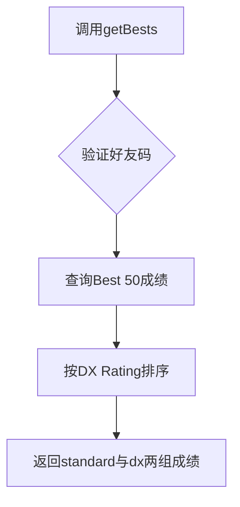
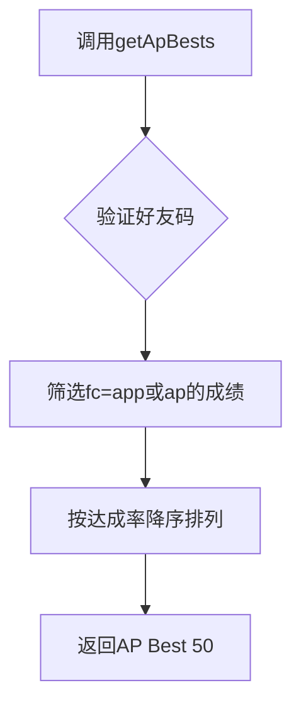
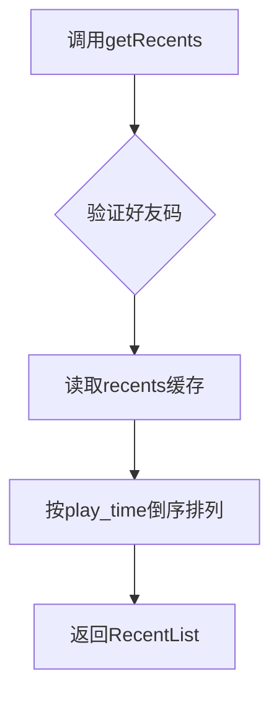
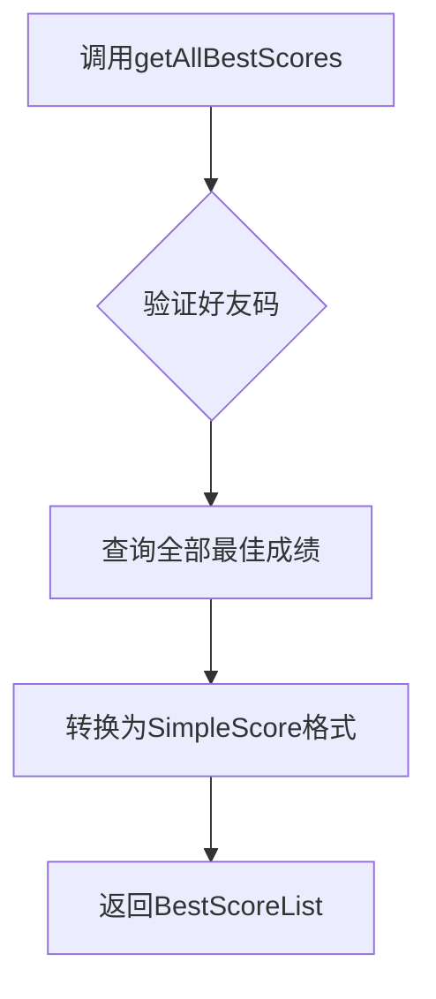
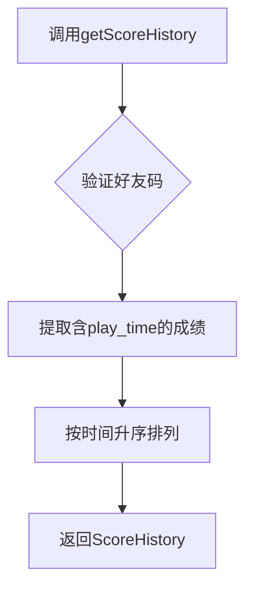
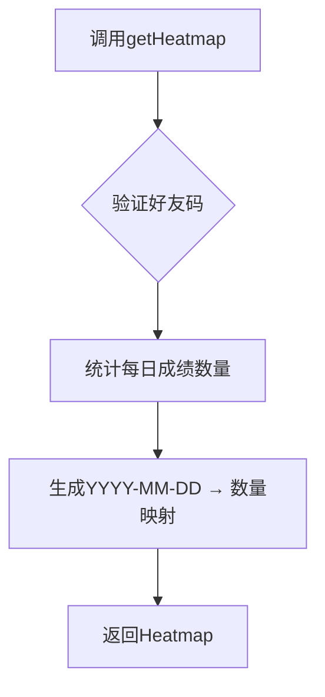
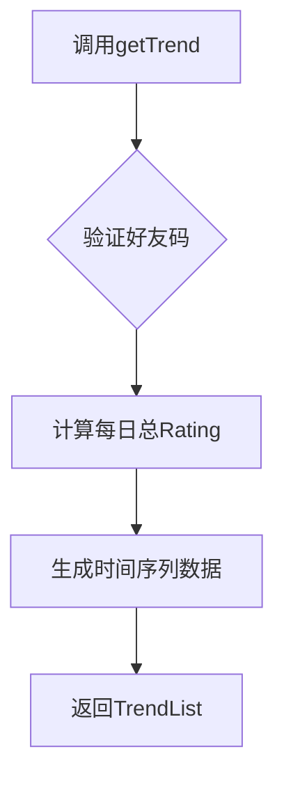

# 成绩数据查询

<cite>
**本文档中引用的文件**
- [dev.ts](file://src/apis/maimai/dev.ts)
- [types/dev.ts](file://src/apis/maimai/types/dev.ts)
- [models.ts](file://src/apis/maimai/models.ts)
</cite>

## 目录
1. [简介](#简介)
2. 核心成绩查询接口
   1. [getBests：获取最佳成绩列表](#getbests获取最佳成绩列表)
   2. [getApBests：获取全连（All Perfect）成绩](#getapbests获取全连all-perfect成绩)
   3. [getRecents：获取最近游玩记录](#getrecents获取最近游玩记录)
   4. [getAllBestScores：获取所有曲目最高分汇总](#getallbestscores获取所有曲目最高分汇总)
   5. [getScoreHistory：获取单曲历史表现](#getscorehistory获取单曲历史表现)
   6. [getHeatmap：生成成绩上传热力图](#getheatmap生成成绩上传热力图)
   7. [getTrend：获取Rating趋势变化](#gettrend获取rating趋势变化)
3. [输入参数与数据结构详解](#输入参数与数据结构详解)
4. [TypeScript使用示例](#typescript使用示例)
5. [性能优化与调用限制建议](#性能优化与调用限制建议)

## 简介
本API为开发者提供了一套完整的玩家成绩数据分析能力，涵盖从近期表现到长期趋势的多维度查询功能。通过好友码作为唯一标识，可深入挖掘玩家在《maimai》游戏中的各项核心数据。

**Section sources**
- [dev.ts](file://src/apis/maimai/dev.ts#L0-L149)

## 核心成绩查询接口

### getBests获取最佳成绩列表
该接口用于获取指定玩家的最佳50首歌曲成绩（Best 50），包含标准谱面35首和DX谱面15首的成绩组合。

**业务意义**：反映玩家当前最强的整体实力水平，是衡量玩家综合能力的核心指标。



**Diagram sources**
- [dev.ts](file://src/apis/maimai/dev.ts#L42-L44)
- [types/dev.ts](file://src/apis/maimai/types/dev.ts#L8-L14)

### getApBests获取全连（All Perfect）成绩
专用于筛选并返回玩家达成“全连”（All Perfect）状态的前50条成绩记录。

**业务意义**：展示玩家在操作精度上的极致表现，AP成绩代表无任何Break且所有Note均达到Perfect判定。



**Diagram sources**
- [dev.ts](file://src/apis/maimai/dev.ts#L51-L53)
- [types/dev.ts](file://src/apis/maimai/types/dev.ts#L16-L17)

### getRecents获取最近游玩记录
返回玩家最近完成的50次游戏记录。

**业务意义**：分析玩家近期活跃度、练习偏好及技术进步轨迹的重要依据。



**Diagram sources**
- [dev.ts](file://src/apis/maimai/dev.ts#L60-L62)
- [types/dev.ts](file://src/apis/maimai/types/dev.ts#L19-L20)

### getAllBestScores获取所有曲目最高分汇总
获取玩家所有已游玩曲目的最高分成绩集合（简化版）。

**业务意义**：全面掌握玩家的游戏覆盖广度与各曲目极限表现，适用于统计分析与可视化展示。



**Diagram sources**
- [dev.ts](file://src/apis/maimai/dev.ts#L69-L73)
- [types/dev.ts](file://src/apis/maimai/types/dev.ts#L22-L23)

### getScoreHistory获取单曲历史表现
仅返回带有`play_time`字段的完整成绩历史记录。

**业务意义**：追踪特定歌曲多次游玩的表现演变过程，可用于分析熟练度增长曲线。



**Diagram sources**
- [dev.ts](file://src/apis/maimai/dev.ts#L98-L102)
- [types/dev.ts](file://src/apis/maimai/types/dev.ts#L30-L31)

### getHeatmap生成成绩上传热力图
以日期为键，返回每日上传成绩的数量分布。

**业务意义**：直观呈现玩家的日常活跃模式，识别高频练习日与休整周期。



**Diagram sources**
- [dev.ts](file://src/apis/maimai/dev.ts#L80-L82)
- [types/dev.ts](file://src/apis/maimai/types/dev.ts#L25-L26)

### getTrend获取Rating趋势变化
返回玩家DX Rating随时间变化的趋势数据序列。

**业务意义**：揭示玩家长期技术水平的发展轨迹，判断上升期或瓶颈期。



**Diagram sources**
- [dev.ts](file://src/apis/maimai/dev.ts#L89-L91)
- [types/dev.ts](file://src/apis/maimai/types/dev.ts#L28-L29)

## 输入参数与数据结构详解
所有接口均接受`friendCode`作为必填参数，表示目标玩家的好友码。

### Score 数据结构
| 字段名 | 类型 | 描述 |
|-------|------|------|
| id | number | 曲目ID |
| song_name | string? | 曲名（仅查询时返回） |
| level | string? | 难度标级（如14+） |
| level_index | LevelIndex | 难度索引（BASIC=0至RE_MASTER=4） |
| achievements | number | 达成率（百分比数值） |
| fc | FCType? | FULL COMBO类型 |
| fs | FSType? | FULL SYNC类型 |
| dx_score | number | DX分数 |
| dx_rating | number? | DX Rating值（向下取整） |
| play_time | string? | 游玩UTC时间（精确到分钟） |

### RatingTrend 数据结构
| 字段名 | 类型 | 描述 |
|-------|------|------|
| total | number | 当日总DX Rating |
| standard | number | 旧版本谱面Rating |
| dx | number | 新版本谱面Rating |
| date | string | 日期（YYYY-MM-DD格式） |

**Section sources**
- [models.ts](file://src/apis/maimai/models.ts#L230-L282)
- [types/dev.ts](file://src/apis/maimai/types/dev.ts#L28-L29)

## TypeScript使用示例
```typescript
import { LxnsApiClient } from "lxns-rhythm-api";

const client = new LxnsApiClient({ devAccessToken: "your-token" });

// 分析玩家难度偏好分布
async function analyzeLevelPreference(friendCode: number) {
  const scores = await client.maimai.dev.getAllBestScores(friendCode);
  const levelCount: Record<string, number> = {};
  
  for (const score of scores) {
    levelCount[score.level] = (levelCount[score.level] || 0) + 1;
  }
  
  return Object.entries(levelCount).sort((a, b) => b[1] - a[1]);
}

// 获取Rating增长曲线
async function getRatingGrowth(friendCode: number) {
  const trend = await client.maimai.dev.getTrend(friendCode);
  return trend.map(t => ({ date: t.date, rating: t.total }));
}
```

**Section sources**
- [dev.ts](file://src/apis/maimai/dev.ts#L0-L149)
- [types/dev.ts](file://src/apis/maimai/types/dev.ts#L28-L29)

## 性能优化与调用限制建议
- **速率限制**：建议每秒不超过5次请求，避免触发API限流机制。
- **缓存策略**：对`getAllBestScores`等高开销接口结果进行本地缓存（建议TTL≥5分钟）。
- **批量处理**：优先使用`getBests`而非逐曲查询以减少网络往返次数。
- **增量更新**：结合`getRecents`与`getScoreHistory`实现增量数据同步，降低服务器负载。
- **错误重试**：实现指数退避重试机制应对临时性网络故障。

**Section sources**
- [dev.ts](file://src/apis/maimai/dev.ts#L0-L149)