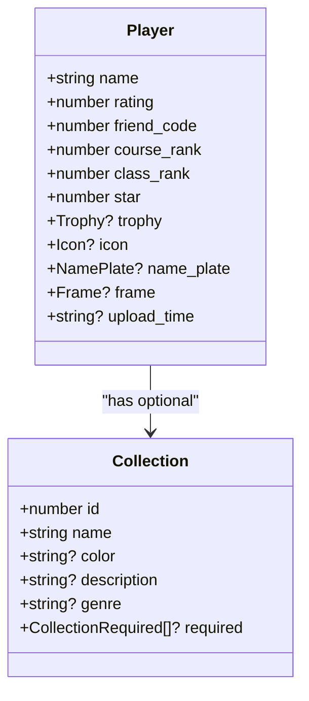

# 玩家信息操作

<cite>
**本文档引用的文件**
- [dev.ts](file://src/apis/maimai/dev.ts)
- [models.ts](file://src/apis/maimai/models.ts)
- [LxnsApiCLient.ts](file://src/client/LxnsApiCLient.ts)
- [types/dev.ts](file://src/apis/maimai/types/dev.ts)
</cite>

## 目录
1. [简介](#简介)
2. [核心接口说明](#核心接口说明)
3. [玩家数据结构详解](#玩家数据结构详解)
4. [调用示例与客户端初始化](#调用示例与客户端初始化)
5. [参数验证与错误响应](#参数验证与错误响应)
6. [安全与性能建议](#安全与性能建议)

## 简介
本文档为开发者提供关于 `getPlayer`、`getPlayerByQQ` 和 `postPlayer` 三个核心接口的详细使用说明。这些接口属于 maimai 开发者 API，允许拥有有效 `devAccessToken` 的开发者查询或注册玩家信息。通过好友码可获取玩家基本信息及成绩概览；通过 QQ 号可查找已公开绑定的玩家；`postPlayer` 接口用于在系统中注册新玩家以启用数据追踪功能。

**Section sources**
- [dev.ts](file://src/apis/maimai/dev.ts#L0-L150)

## 核心接口说明

### getPlayer：通过好友码查询玩家信息
该方法用于根据指定的好友码（`friendCode`）获取玩家的基本信息和成绩概览。

- **用途**：适用于需要基于游戏内唯一标识（好友码）检索玩家数据的场景。
- **路径**：`GET /player/{friendCode}`
- **参数类型**：`number`
- **返回类型**：`Dev.PlayerInfo`

**Section sources**
- [dev.ts](file://src/apis/maimai/dev.ts#L24-L26)

### getPlayerByQQ：通过QQ号查询玩家信息
此方法允许开发者通过绑定且已公开的QQ号码查找对应玩家。

- **前提条件**：目标玩家必须已在系统中将QQ号设置为公开状态。
- **用途**：便于社交整合或用户身份映射。
- **路径**：`GET /player/qq/{qq}`
- **参数类型**：`number`
- **返回类型**：`Dev.PlayerInfo`

**Section sources**
- [dev.ts](file://src/apis/maimai/dev.ts#L33-L35)

### postPlayer：注册新玩家
用于向系统注册一名新玩家，以便后续进行数据同步与追踪。

- **用途**：首次接入玩家数据时调用，确保系统开始记录其成绩。
- **路径**：`POST /player`
- **请求体**：符合 `Player` 模型结构的对象
- **返回类型**：`Dev.PlayerInfo`
- **注意事项**：提交的数据需完整且符合字段要求，否则可能导致注册失败。

**Section sources**
- [dev.ts](file://src/apis/maimai/dev.ts#L15-L17)

## 玩家数据结构详解
`Player` 接口定义了玩家的核心属性，所有查询接口均基于此模型返回数据。



**Diagram sources**
- [models.ts](file://src/apis/maimai/models.ts#L132-L155)

### 关键字段说明
- `name`: 游戏内显示名称
- `rating`: 当前 DX Rating 分数
- `friend_code`: 唯一好友码，用于精准定位玩家
- `course_rank` / `class_rank`: 段位与阶级 ID
- `star`: 搭档觉醒数量
- `trophy`, `icon`, `name_plate`, `frame`: 玩家自定义外观项（可选）
- `upload_time`: 数据最后同步时间（UTC格式，仅查询时返回）

**Section sources**
- [models.ts](file://src/apis/maimai/models.ts#L132-L155)

## 调用示例与客户端初始化
以下代码展示如何使用 `devAccessToken` 初始化客户端并安全地调用相关接口。

```typescript
import { LxnsApiClient } from "lxns-rhythm-api";

// 初始化客户端（需提供有效的 devAccessToken）
const client = new LxnsApiClient({
  devAccessToken: "<your-dev-token>",
});

// 查询指定好友码的玩家信息
const player = await client.maimai.dev.getPlayer(12345678);
console.log(player.name, player.rating);

// 通过QQ号查找玩家（需确保QQ已公开绑定）
const playerByQQ = await client.maimai.dev.getPlayerByQQ(1507524536);
console.log(playerByQQ.friend_code);

// 注册新玩家
const newPlayer = {
  name: "NewPlayer",
  rating: 0,
  friend_code: 87654321,
  course_rank: 0,
  class_rank: 0,
  star: 0,
};
await client.maimai.dev.postPlayer(newPlayer);
```

**Section sources**
- [LxnsApiCLient.ts](file://src/client/LxnsApiCLient.ts#L0-L80)
- [dev.ts](file://src/apis/maimai/dev.ts#L15-L17)

## 参数验证与错误响应
### 参数验证规则
- `friendCode` 和 `qq` 必须为合法数字，长度通常为 8 位。
- `postPlayer` 请求体中的 `name` 和 `friend_code` 为必填项。
- 所有数值字段不得为负数或非数字类型。

### 常见错误响应
| 错误类型 | HTTP状态码 | 描述 |
|--------|----------|------|
| 好友码不存在 | 404 Not Found | 提供的好友码未在系统中注册 |
| 格式无效 | 400 Bad Request | 输入参数不符合预期格式（如非数字） |
| 权限不足 | 401 Unauthorized | `devAccessToken` 缺失或无效 |
| QQ未公开绑定 | 404 Not Found | 对应QQ号未被任何玩家公开绑定 |

**Section sources**
- [dev.ts](file://src/apis/maimai/dev.ts#L15-L35)

## 安全与性能建议
### 安全性
- `devAccessToken` 应严格保密，禁止在前端或公开仓库中暴露。
- 使用 HTTPS 加密通信，防止中间人攻击。
- 定期轮换访问令牌以降低泄露风险。

### 性能优化
- **缓存策略**：对频繁查询的玩家数据实施本地缓存（如 Redis 或内存缓存），避免重复请求。
- **批量处理**：若需获取多个玩家信息，建议结合业务逻辑合并请求或使用队列机制减少并发压力。
- **限流控制**：遵守 API 调用频率限制，避免触发服务端限流。

**Section sources**
- [LxnsApiCLient.ts](file://src/client/LxnsApiCLient.ts#L29-L40)