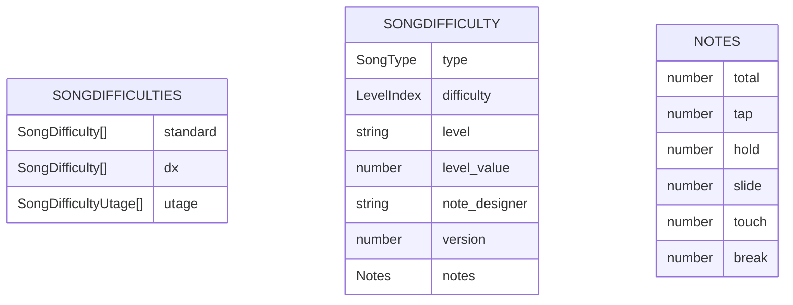
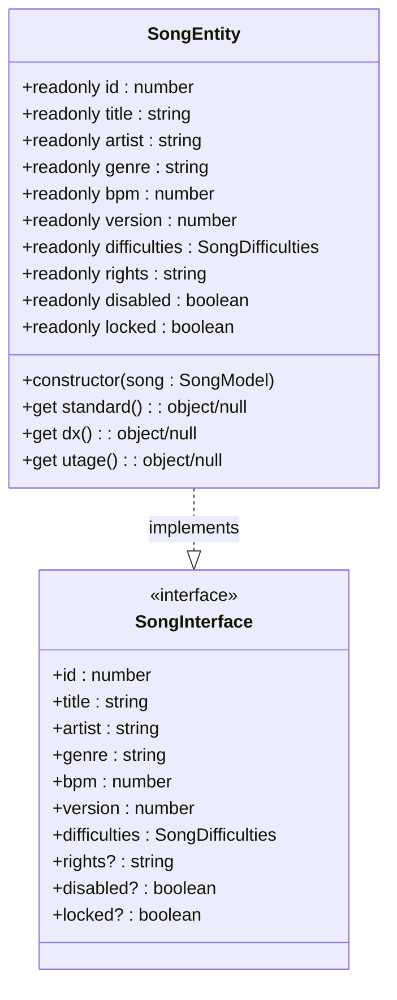
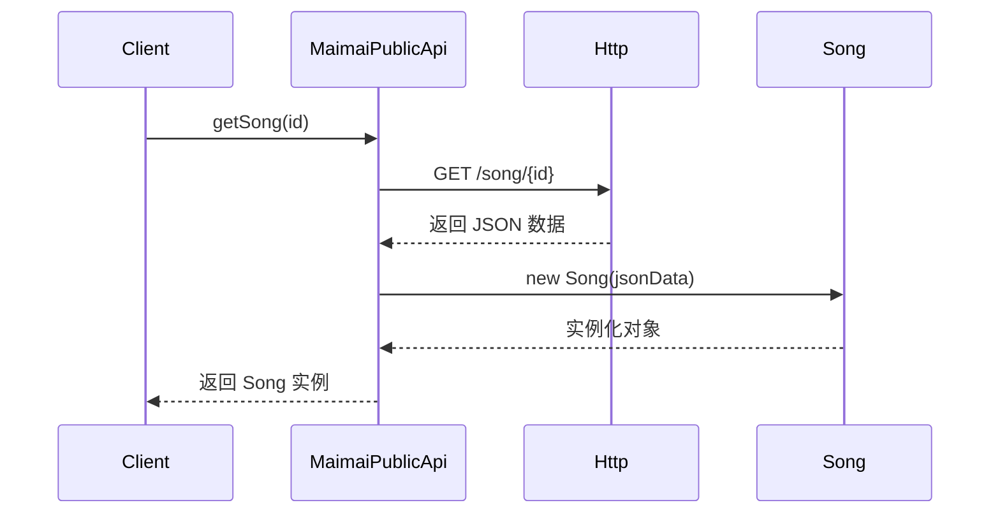

# 歌曲模型 (Song)

<cite>
**本文档中引用的文件**
- [Song.ts](file://src/apis/maimai/entities/Song.ts)
- [models.ts](file://src/apis/maimai/models.ts)
- [public.ts](file://src/apis/maimai/public.ts)
</cite>

## 目录
1. [简介](#简介)
2. [核心字段说明](#核心字段说明)
3. [难度与谱面信息](#难度与谱面信息)
4. [计算属性详解](#计算属性详解)
5. [实体类与接口关系](#实体类与接口关系)
6. [API 应用场景示例](#api-应用场景示例)
7. [JSON 序列化输出示例](#json-序列化输出示例)
8. [代码使用示例](#代码使用示例)

## 简介

`Song` 实体类是 maimai 音乐游戏数据系统中的核心数据模型，用于封装每首歌曲的完整元数据。该类基于 `models.ts` 中定义的 `Song` 接口实现，通过面向对象的方式组织原始 JSON 数据，并提供便捷的访问方式。

该实体不仅存储基础信息如 ID、标题、艺术家、流派和 BPM，还通过 getter 计算属性（`standard`、`dx`、`utage`）对不同版本的谱面数据进行结构化处理，使开发者能够以更直观的方式访问特定版本的难度信息。

**Section sources**
- [Song.ts](file://src/apis/maimai/entities/Song.ts#L1-L10)
- [models.ts](file://src/apis/maimai/models.ts#L67-L129)

## 核心字段说明

`Song` 类包含以下只读字段，均来自 `SongModel` 接口：

| 字段名 | 类型 | 说明 |
|-------|------|------|
| id | number | 歌曲唯一标识符 |
| title | string | 歌曲名称 |
| artist | string | 演唱者或创作者 |
| genre | string | 音乐流派分类 |
| bpm | number | 每分钟节拍数（BPM） |
| version | number | 所属游戏版本编号 |
| rights | string? | 版权信息（可选） |
| disabled | boolean? | 是否禁用（默认 false） |
| locked | boolean? | 是否锁定（默认 false） |

这些字段在构造函数中初始化，确保数据的一致性和不可变性。

**Section sources**
- [Song.ts](file://src/apis/maimai/entities/Song.ts#L15-L30)
- [models.ts](file://src/apis/maimai/models.ts#L67-L129)

## 难度与谱面信息

歌曲的难度信息通过 `difficulties` 字段组织，其结构由 `SongDifficulties` 接口定义：



**Diagram sources**
- [models.ts](file://src/apis/maimai/models.ts#L67-L129)
- [models.ts](file://src/apis/maimai/models.ts#L0-L65)

### 各版本谱面说明

- **standard**: 标准版谱面数组，包含 basic 到 remaster 五个难度
- **dx**: DX 版谱面数组，同样包含五个难度等级
- **utage**: 宴会场谱面数组（可选），具有汉字属性和描述字段

每个谱面条目都包含等级、谱师、版本号以及详细的物量统计（notes），便于分析演奏复杂度。

**Section sources**
- [models.ts](file://src/apis/maimai/models.ts#L67-L129)

## 计算属性详解

`Song` 类通过三个 getter 属性将原始数组形式的难度数据转换为以难度名称为键的对象字典，极大提升了数据访问效率。

### standard
```typescript
get standard()
```
将 `difficulties.standard` 数组转换为 `{ basic, advanced, expert, master, remaster }` 结构的对象。若无数据则返回 null。

### dx
```typescript
get dx()
```
将 `difficulties.dx` 数组转换为相同命名结构的对象。若无数据则返回 null。

### utage
```typescript
get utage()
```
将 `difficulties.utage` 数组转换为命名对象。若该字段不存在则返回 null。

这种转换由内部工具函数 `convertDifficulty` 实现，利用 `LevelIndex` 枚举与字符串数组 `LevelArray` 的映射关系完成索引到名称的转换。

**Section sources**
- [Song.ts](file://src/apis/maimai/entities/Song.ts#L47-L64)
- [models.ts](file://src/apis/maimai/models.ts#L67-L129)

## 实体类与接口关系

`Song` 类实现了 `models.ts` 中定义的 `Song` 接口，形成“契约-实现”关系：



**Diagram sources**
- [Song.ts](file://src/apis/maimai/entities/Song.ts#L22)
- [models.ts](file://src/apis/maimai/models.ts#L67-L129)

此设计保证了类型安全，同时允许实体类扩展额外逻辑（如计算属性）而不影响接口契约。

**Section sources**
- [Song.ts](file://src/apis/maimai/entities/Song.ts#L22)
- [models.ts](file://src/apis/maimai/models.ts#L67-L129)

## API 应用场景示例

在 `MaimaiPublicApi` 中，`Song` 实体被用于封装 API 响应数据：



**Diagram sources**
- [public.ts](file://src/apis/maimai/public.ts#L29)
- [Song.ts](file://src/apis/maimai/entities/Song.ts#L22)

例如调用 `getSong(123)` 后，返回的是一个 `Song` 实例，开发者可直接访问其属性或使用计算属性获取结构化谱面数据。

**Section sources**
- [public.ts](file://src/apis/maimai/public.ts#L29)

## JSON 序列化输出示例

当 `Song` 实例被序列化为 JSON 时，其结构如下：

```json
{
  "id": 123,
  "title": "红",
  "artist": "DECO*27",
  "genre": "VOCALOID",
  "bpm": 180,
  "version": 5,
  "rights": "© DECO*27",
  "disabled": false,
  "locked": false,
  "difficulties": {
    "standard": [
      {
        "type": "standard",
        "difficulty": 0,
        "level": "7",
        "level_value": 7.5,
        "note_designer": "P3",
        "version": 1,
        "notes": {
          "total": 320,
          "tap": 200,
          "hold": 30,
          "slide": 40,
          "touch": 10,
          "break": 40
        }
      }
    ],
    "dx": [],
    "utage": null
  }
}
```

注意：getter 属性（`standard`, `dx`, `utage`）不会出现在序列化结果中，仅作为运行时访问便利方法存在。

**Section sources**
- [Song.ts](file://src/apis/maimai/entities/Song.ts#L15-L30)

## 代码使用示例

以下是如何实例化并使用 `Song` 对象的示例：

```typescript
// 假设从 API 获取到原始数据
const rawData = await api.getSong(123);

// 自动转换为 Song 实例
const song = new Song(rawData);

// 访问基本信息
console.log(song.title); // 输出: 红
console.log(song.artist); // 输出: DECO*27

// 使用计算属性访问 DX 谱面
if (song.dx) {
  const masterChart = song.dx.master;
  if (masterChart) {
    console.log(masterChart.level); // 如: "14+"
    console.log(masterChart.note_designer); // 谱师信息
  }
}

// 访问标准版专家谱面
const expert = song.standard?.expert;
if (expert && expert.notes) {
  console.log(`总物量: ${expert.notes.total}`);
}
```

此模式使得代码更具可读性，避免了繁琐的数组索引操作。

**Section sources**
- [Song.ts](file://src/apis/maimai/entities/Song.ts#L47-L64)
- [public.ts](file://src/apis/maimai/public.ts#L29)