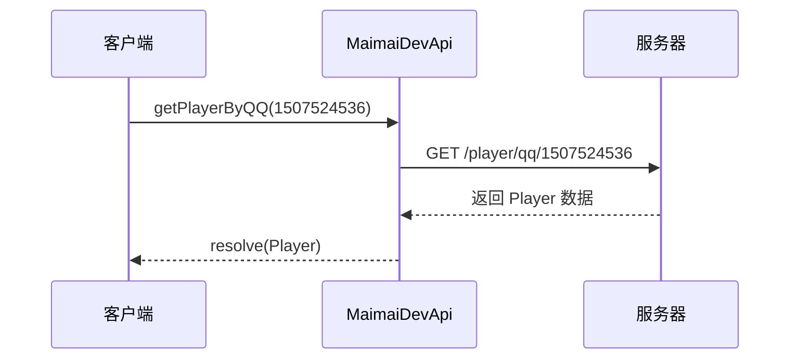
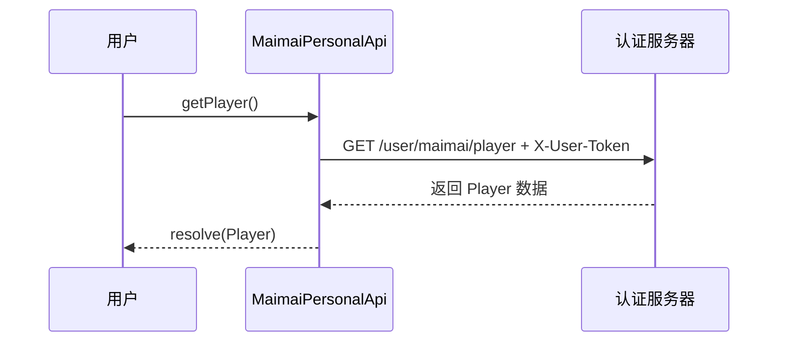
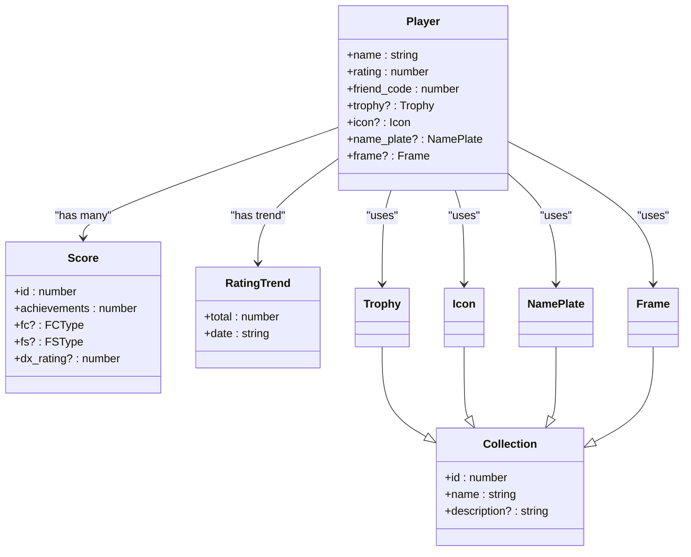

# 玩家模型 (Player)

<cite>
**本文档中引用的文件**
- [models.ts](file://src/apis/maimai/models.ts#L132-L155)
- [dev.ts](file://src/apis/maimai/dev.ts#L0-L53)
- [personal.ts](file://src/apis/maimai/personal.ts#L0-L40)
- [types/dev.ts](file://src/apis/maimai/types/dev.ts#L0-L41)
- [types/personal.ts](file://src/apis/maimai/types/personal.ts#L0-L15)
</cite>

## 目录
1. [简介](#简介)
2. [核心字段定义与用途](#核心字段定义与用途)
3. [API 使用场景](#api-使用场景)
4. [JSON 示例数据](#json-示例数据)
5. [与其他模型的关联关系](#与其他模型的关联关系)
6. [在高级功能中的作用](#在高级功能中的作用)
7. [结论](#结论)

## 简介

`Player` 接口是本项目中用于表示玩家核心信息的数据模型，广泛应用于开发者 API 和个人 API 中。该模型封装了玩家在游戏中的基本属性、状态标识以及个性化装饰等信息，是构建用户画像、实现成绩分析和排行榜系统的基础结构。

通过 `getPlayer`（通过好友码）和 `getPlayerByQQ`（通过 QQ 号）等接口获取的返回值均基于此模型，确保了跨平台数据的一致性与可扩展性。

**Section sources**
- [models.ts](file://src/apis/maimai/models.ts#L132-L155)
- [dev.ts](file://src/apis/maimai/dev.ts#L0-L53)

## 核心字段定义与用途

以下是 `Player` 接口中各字段的详细说明：

| 字段名 | 类型 | 是否可选 | 含义 |
|-------|------|--------|------|
| `name` | `string` | 必填 | 游戏内名称，即玩家昵称，用于展示和识别玩家身份 |
| `rating` | `number` | 必填 | 当前 DX Rating 值，反映玩家整体技术水平的核心指标 |
| `friend_code` | `number` | 必填 | 好友码，作为玩家唯一标识之一，用于查询或同步数据 |
| `course_rank` | `number` | 必填 | 段位 ID，表示玩家当前所处的段位等级 |
| `class_rank` | `number` | 必填 | 阶级 ID，代表玩家的技术阶级（如初学者、专家等） |
| `star` | `number` | 必填 | 搭档觉醒数，记录玩家搭档系统的进度 |
| `trophy` | `Trophy` | 可选 | 称号信息，包含称号 ID、名称及颜色等，仅上传时可为空 |
| `icon` | `Icon` | 可选 | 头像信息，个性化外观的一部分 |
| `name_plate` | `NamePlate` | 可选 | 姓名框信息，用于装饰玩家名字显示区域 |
| `frame` | `Frame` | 可选 | 背景信息，界面背景图设置 |
| `upload_time` | `string` | 可选 | 玩家数据被同步时的 UTC 时间戳，仅在获取时返回 |

这些字段共同构成了一个完整的玩家状态快照，支持从基础信息到视觉表现的全方位描述。

**Section sources**
- [models.ts](file://src/apis/maimai/models.ts#L132-L155)

## API 使用场景

### 开发者 API 场景

在拥有 `devAccessToken` 的前提下，可通过 `MaimaiDevApi` 访问以下方法：

- **`getPlayer(friendCode: number)`**：根据好友码获取指定玩家信息。
- **`getPlayerByQQ(qq: number)`**：根据 QQ 号获取玩家信息，适用于绑定社交账号的场景。

这两个接口的返回类型均为 `Dev.PlayerInfo`，其实际结构为 `Player` 接口本身（通过 `type PlayerInfo = Models.Player;` 定义），因此返回值直接映射为 `Player` 模型实例。



**Diagram sources**
- [dev.ts](file://src/apis/maimai/dev.ts#L0-L53)
- [types/dev.ts](file://src/apis/maimai/types/dev.ts#L0-L41)

### 个人 API 场景

当用户提供 `personalAccessToken` 后，可通过 `MaimaiPersonalApi` 调用：

- **`getPlayer()`**：获取当前登录用户的玩家信息。

该接口位于 `/user/maimai/player` 路径下，返回结果同样遵循 `Player` 结构，并通过 `Personal.PlayerInfo = Player` 映射实现类型复用。



**Diagram sources**
- [personal.ts](file://src/apis/maimai/personal.ts#L0-L40)
- [types/personal.ts](file://src/apis/maimai/types/personal.ts#L0-L15)

## JSON 示例数据

以下为不同状态下玩家信息的真实感 JSON 示例：

### 示例一：完整玩家数据（已配置所有装饰）

```json
{
  "name": "星野梦",
  "rating": 14850,
  "friend_code": 12345678,
  "course_rank": 7,
  "class_rank": 12,
  "star": 5,
  "trophy": {
    "id": 1001,
    "name": "舞神之证",
    "color": "#FFD700"
  },
  "icon": {
    "id": 2001,
    "name": "星辰头像"
  },
  "name_plate": {
    "id": 3001,
    "name": "银河边框"
  },
  "frame": {
    "id": 4001,
    "name": "极光背景"
  },
  "upload_time": "2025-04-05T10:30:00Z"
}
```

### 示例二：基础玩家数据（未设置装饰）

```json
{
  "name": "节奏新手",
  "rating": 6200,
  "friend_code": 87654321,
  "course_rank": 3,
  "class_rank": 5,
  "star": 1,
  "upload_time": "2025-04-04T18:22:15Z"
}
```

以上示例展示了 `Player` 模型在不同情境下的灵活表达能力。

**Section sources**
- [models.ts](file://src/apis/maimai/models.ts#L132-L155)

## 与其他模型的关联关系

`Player` 模型并非孤立存在，而是与多个其他核心模型形成紧密关联：

- **`Score` 模型**：每位玩家拥有多个成绩记录，`Score` 表示单曲成绩，通过 `player_id` 或 `friend_code` 关联至 `Player`。例如 `getScores()` 返回的成绩列表即属于该玩家。
- **`Collection` 模型**：`trophy`, `icon`, `name_plate`, `frame` 均继承自 `Collection` 接口，共享 `id`, `name`, `description` 等通用字段，体现收藏品体系的一致性。
- **`RatingTrend` 模型**：`rating` 字段的变化历史可通过 `getTrend(friendCode)` 获取趋势数据，用于绘制 Rating 曲线图。

这种设计实现了高内聚低耦合的架构原则，便于维护与扩展。



**Diagram sources**
- [models.ts](file://src/apis/maimai/models.ts#L132-L155)
- [models.ts](file://src/apis/maimai/models.ts#L231-L262)
- [models.ts](file://src/apis/maimai/models.ts#L284-L300)

**Section sources**
- [models.ts](file://src/apis/maimai/models.ts#L132-L155)
- [models.ts](file://src/apis/maimai/models.ts#L231-L262)

## 在高级功能中的作用

### 成绩分析

`Player` 模型中的 `rating` 和 `upload_time` 字段可用于追踪玩家成长轨迹。结合 `getTrend()` 接口返回的 `RatingTrend` 数据，可生成动态 Rating 曲线，辅助分析技术提升趋势。

此外，`course_rank` 与 `class_rank` 可用于判断玩家所处的成长阶段，进而提供个性化的训练建议。

### 排行榜构建

在实现全球或区域排行榜时，`Player` 的 `rating` 字段是排序的主要依据。通过批量获取多个 `Player` 实例并按 `rating` 降序排列，即可快速生成权威榜单。

同时，`name`, `trophy`, `icon` 等字段丰富了排行榜的视觉呈现效果，增强用户体验。

### 数据同步与校验

`upload_time` 提供了数据新鲜度参考，系统可根据此时间决定是否需要重新抓取最新数据。结合 `friend_code` 作为唯一键，可有效避免重复录入，保障数据一致性。

## 结论

`Player` 接口作为 maimai 数据生态的核心组成部分，不仅定义了玩家的基本属性与状态，还通过良好的类型设计实现了与 `Score`、`Collection` 等模型的无缝集成。其在开发者 API 与个人 API 中的广泛应用，证明了其高可用性与扩展性。

未来可通过增加更多元化的装饰字段或行为日志字段进一步丰富该模型，以适应更复杂的业务需求。