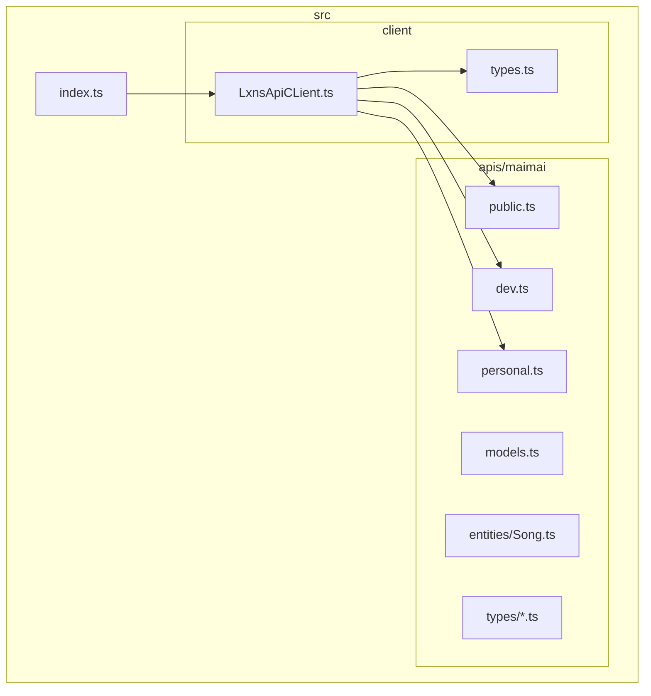
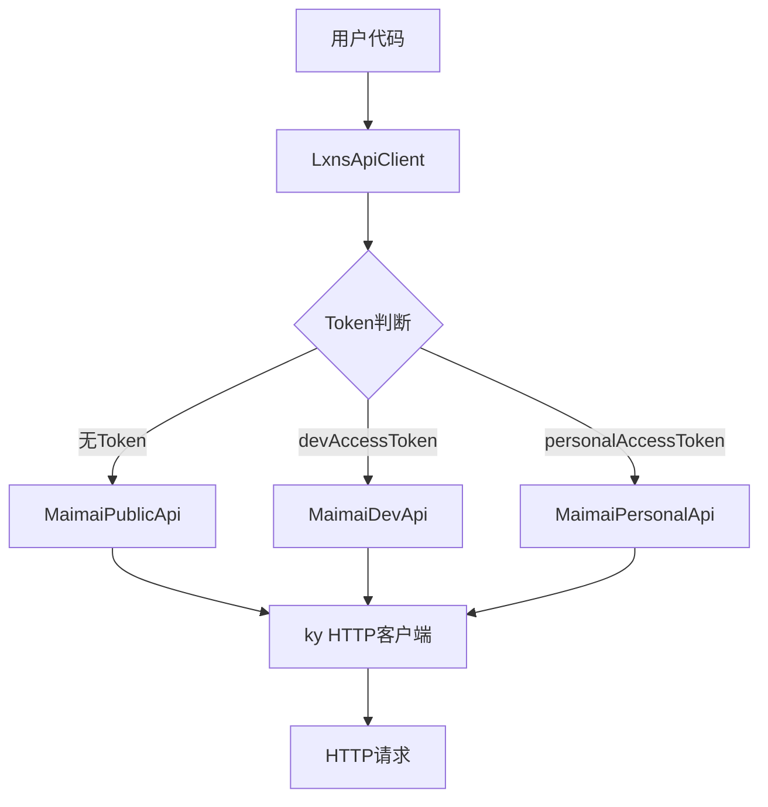
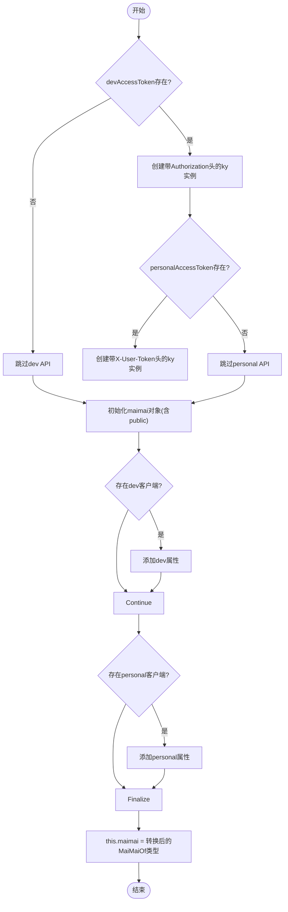
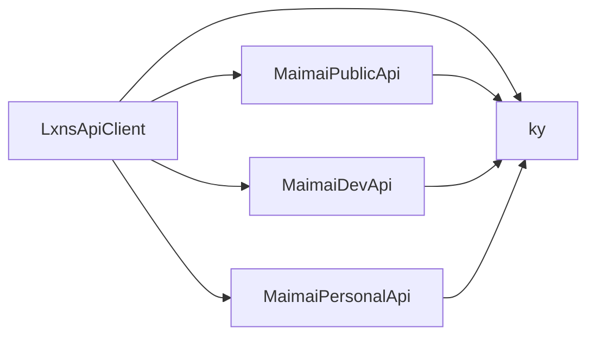

# 核心客户端API

<cite>
**本文档引用的文件**
- [LxnsApiCLient.ts](file://src/client/LxnsApiCLient.ts)
- [types.ts](file://src/client/types.ts)
- [public.ts](file://src/apis/maimai/public.ts)
- [dev.ts](file://src/apis/maimai/dev.ts)
- [personal.ts](file://src/apis/maimai/personal.ts)
</cite>

## 目录
1. [简介](#简介)
2. [项目结构](#项目结构)
3. [核心组件](#核心组件)
4. [架构概述](#架构概述)
5. [详细组件分析](#详细组件分析)
6. [依赖分析](#依赖分析)
7. [性能考虑](#性能考虑)
8. [故障排除指南](#故障排除指南)
9. [结论](#结论)

## 简介
本SDK为访问Lxns API提供了一个轻量级、类型安全的TypeScript接口。其核心是`LxnsApiClient`类，作为整个SDK的入口点，通过条件逻辑和TypeScript高级类型系统，动态暴露不同权限级别的API接口。开发者可根据传入的令牌（token）自动获得对应的API访问能力，同时在编译期防止非法调用。

## 项目结构
该项目采用模块化设计，主要分为`apis`和`client`两个目录。`apis`中按功能划分了maimai相关的公共、开发者和个人API实现；`client`则包含客户端主类及类型定义。整体结构清晰，职责分明。



**图示来源**
- [LxnsApiCLient.ts](file://src/client/LxnsApiCLient.ts#L1-L81)
- [types.ts](file://src/client/types.ts#L1-L33)

**节来源**
- [LxnsApiCLient.ts](file://src/client/LxnsApiCLient.ts#L1-L81)
- [types.ts](file://src/client/types.ts#L1-L33)

## 核心组件
`LxnsApiClient`类是SDK的核心，负责初始化配置、创建HTTP客户端实例，并根据提供的令牌动态挂载相应的API子模块。其构造函数接受一个可选的配置对象，用于自定义基础URL和认证令牌。

**节来源**
- [LxnsApiCLient.ts](file://src/client/LxnsApiCLient.ts#L10-L81)

## 架构概述
该SDK采用基于Token权限控制的分层架构。通过TypeScript的条件类型机制，在编译时精确决定哪些API方法对当前实例可见，从而实现类型安全的API访问控制。



**图示来源**
- [LxnsApiCLient.ts](file://src/client/LxnsApiCLient.ts#L1-L81)
- [public.ts](file://src/apis/maimai/public.ts#L1-L103)
- [dev.ts](file://src/apis/maimai/dev.ts#L1-L149)
- [personal.ts](file://src/apis/maimai/personal.ts#L1-L41)

## 详细组件分析

### LxnsApiClient构造函数与配置参数分析
`LxnsApiClient`的构造函数接收一个泛型配置对象`O extends LxnsApiClientOptions`，其中包含三个关键字段：`baseURL`、`devAccessToken`和`personalAccessToken`。

- `baseURL`: 自定义API的基础地址，默认为`https://maimai.lxns.net/api/v0/`
- `devAccessToken`: 启用开发者API权限的令牌
- `personalAccessToken`: 启用个人API权限的令牌

构造函数内部会根据这些配置创建不同的ky HTTP客户端实例，并依据是否存在对应token来决定是否将`MaimaiDevApi`或`MaimaiPersonalApi`挂载到`maimai`命名空间下。

#### 条件逻辑与API挂载流程


**图示来源**
- [LxnsApiCLient.ts](file://src/client/LxnsApiCLient.ts#L32-L80)

**节来源**
- [LxnsApiCLient.ts](file://src/client/LxnsApiCLient.ts#L10-L81)

### TypeScript类型推断机制分析
SDK利用TypeScript的高级类型特性，在编译期精确控制API方法的可见性。

#### MaiMaiOf条件类型解析
```mermaid
classDiagram
class MaiMai {
+public : MaimaiPublicApi
+dev? : MaimaiDevApi
+personal? : MaimaiPersonalApi
+getAsset(type, id) : Promise~Buffer~
}
class MaiMaiOf~O~ {
<<type alias>>
Omit<MaiMai, "dev"|"personal">
IfDefined<O["devAccessToken"], { dev : MaimaiDevApi }>
IfDefined<O["personalAccessToken"], { personal : MaimaiPersonalApi }>
}
class IfDefined~T, Then, Else~ {
<<conditional type>>
[T] extends [NonNullable~T~] ? Then : Else
}
MaiMaiOf~O~ --> IfDefined~T, Then, Else~ : 使用
MaiMaiOf~O~ --> MaiMai : 继承并改造
```

**图示来源**
- [types.ts](file://src/client/types.ts#L28-L32)
- [types.ts](file://src/client/types.ts#L20-L26)

**节来源**
- [types.ts](file://src/client/types.ts#L1-L33)

当开发者使用不同token实例化`LxnsApiClient`时，IDE会根据类型推断显示不同的自动补全选项：
- 无token：仅显示`public`和`getAsset`
- 提供`devAccessToken`：额外显示`dev`命名空间下的方法
- 提供`personalAccessToken`：额外显示`personal`命名空间下的方法

这种设计有效防止了非法调用不存在的API方法。

### HTTP请求封装与响应处理
SDK内部使用`ky`库封装所有HTTP请求。对于公共API、开发者API和个人API分别创建独立的ky实例，并设置不同的前缀URL和认证头信息。

- 公共API：使用`prefixUrl: new URL("maimai/", baseURL)`
- 开发者API：额外添加`Authorization`头
- 个人API：使用`user/maimai/`路径并添加`X-User-Token`头

统一的响应解析通过`.json<T>()`方法完成，错误抛出由`ky`默认行为处理（非2xx状态码自动抛出异常）。

**节来源**
- [LxnsApiCLient.ts](file://src/client/LxnsApiCLient.ts#L32-L60)

## 依赖分析
SDK运行时仅依赖`ky`发起HTTP请求，构建过程依赖TypeScript及相关工具链。各模块间耦合度低，易于维护和扩展。



**图示来源**
- [package.json](file://package.json#L1-L49)
- [LxnsApiCLient.ts](file://src/client/LxnsApiCLient.ts#L1-L81)

**节来源**
- [package.json](file://package.json#L1-L49)

## 性能考虑
由于采用了静态类型检查和按需加载API的设计，运行时几乎没有额外开销。HTTP客户端复用连接，减少握手延迟。资产获取(`getAsset`)单独处理，避免影响主API性能。

## 故障排除指南
常见问题包括：
- Token无效导致401错误
- baseURL配置错误导致请求失败
- 类型推断不准确（通常因TS版本过低）

建议检查网络请求的实际URL和头部信息，确认token有效性，并确保使用支持条件类型的TypeScript版本。

**节来源**
- [LxnsApiCLient.ts](file://src/client/LxnsApiCLient.ts#L1-L81)
- [README.md](file://README.md#L0-L46)

## 结论
`LxnsApiClient`通过巧妙结合运行时逻辑与编译时类型系统，实现了既灵活又安全的API访问机制。开发者可以轻松地根据需要启用不同级别的API权限，同时享受类型安全带来的开发体验提升。这种设计模式值得在其他SDK开发中借鉴。