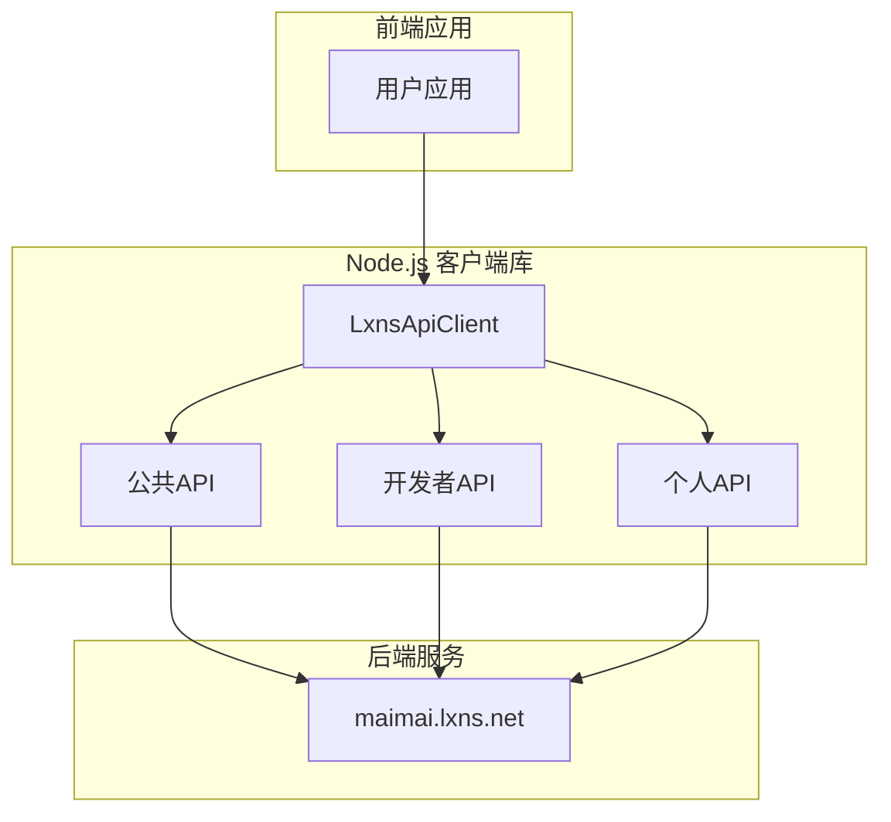

# 性能优化建议

<cite>
**本文档引用的文件**
- [dev.ts](file://src/apis/maimai/types/dev.ts)
- [personal.ts](file://src/apis/maimai/types/personal.ts)
- [dev.ts](file://src/apis/maimai/dev.ts)
- [personal.ts](file://src/apis/maimai/personal.ts)
- [models.ts](file://src/apis/maimai/models.ts)
</cite>

## 目录
1. [简介](#简介)
2. [项目结构](#项目结构)
3. [核心组件](#核心组件)
4. [架构概览](#架构概览)
5. [详细组件分析](#详细组件分析)
6. [依赖分析](#依赖分析)
7. [性能考虑](#性能考虑)
8. [故障排除指南](#故障排除指南)
9. [结论](#结论)

## 简介
本文件旨在为 `lxns-rhythm-api` 项目提供权威的性能优化指导，重点针对高频使用场景提出可落地的改进措施。通过分析代码库中的接口设计、数据结构和调用模式，本文将系统性地阐述如何提升 API 使用效率，减少网络开销，并规避潜在的性能瓶颈。

## 项目结构
该项目是一个基于 Node.js 的 TypeScript 项目，主要服务于“舞萌”（maimai）音乐游戏的数据交互。其结构清晰，按功能划分模块：

- `src/apis/maimai`: 核心 API 实现，包含公共、开发者和个人三种访问级别的接口。
- `src/client`: 提供客户端封装类 `LxnsApiClient`，用于简化对后端 API 的调用。
- `src/index.ts`: 项目的入口和导出点。
- `tests/`: 包含简单的测试用例。

API 分层明确，分别由 `MaimaiPublicApi`、`MaimaiDevApi` 和 `MaimaiPersonalApi` 类实现，对应不同的权限级别。

**Diagram sources**
- [LxnsApiCLient.ts](file://src/client/LxnsApiCLient.ts#L0-L81)
- [public.ts](file://src/apis/maimai/public.ts#L0-L38)
- [dev.ts](file://src/apis/maimai/dev.ts#L0-L149)
- [personal.ts](file://src/apis/maimai/personal.ts#L0-L41)

**Section sources**
- [project_structure](#project_structure)

## 核心组件
本项目的核心在于围绕玩家成绩（Score）和歌曲信息（Song）构建的一系列 API 接口。关键组件包括：
- **成绩上传 (`postScores`)**：支持批量上传，是性能优化的关键切入点。
- **数据缓存与获取**：如歌曲列表等不变数据，可通过缓存显著提升性能。
- **客户端封装 (`LxnsApiClient`)**：负责管理认证和路由不同权限的 API。

**Section sources**
- [models.ts](file://src/apis/maimai/models.ts#L0-L301)
- [dev.ts](file://src/apis/maimai/dev.ts#L0-L149)
- [personal.ts](file://src/apis/maimai/personal.ts#L0-L41)

## 架构概览
系统的整体架构遵循典型的 RESTful 风格，客户端通过 HTTP 请求与后端服务器进行通信。`LxnsApiClient` 作为中间件，根据配置的 token 权限，动态挂载 `public`、`dev` 或 `personal`