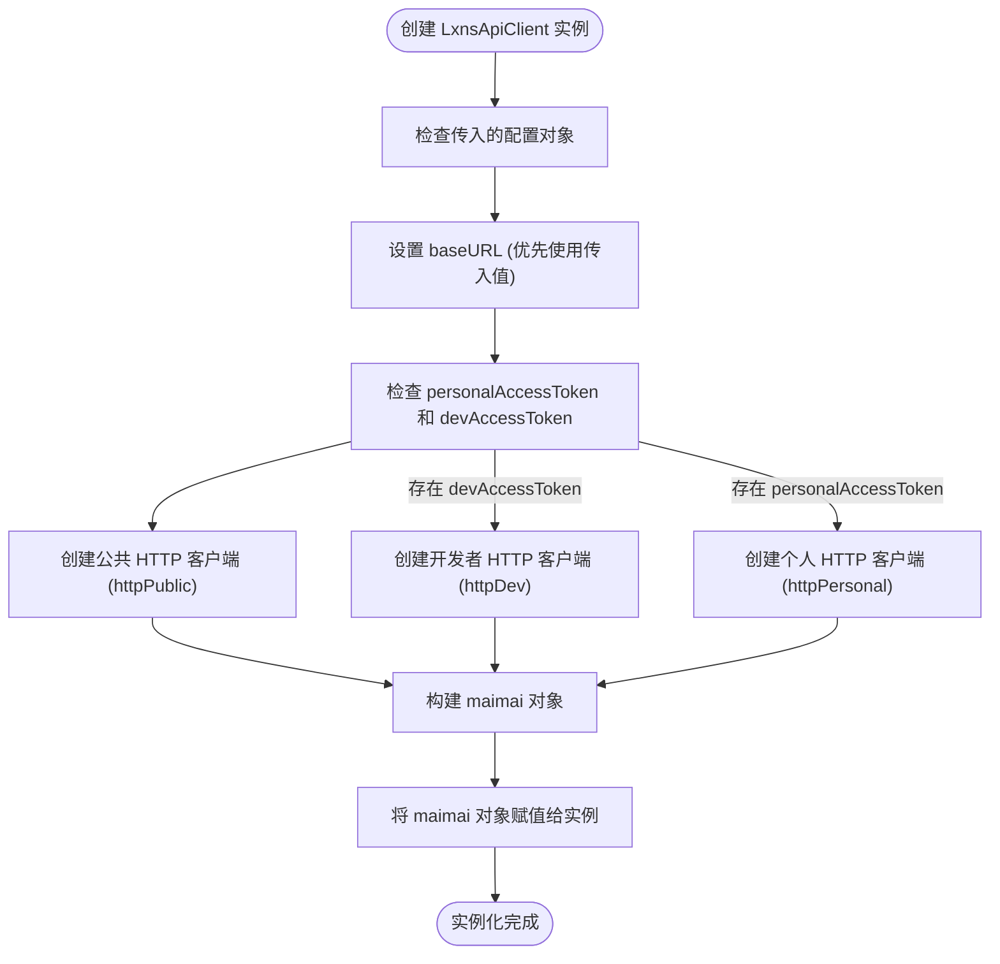
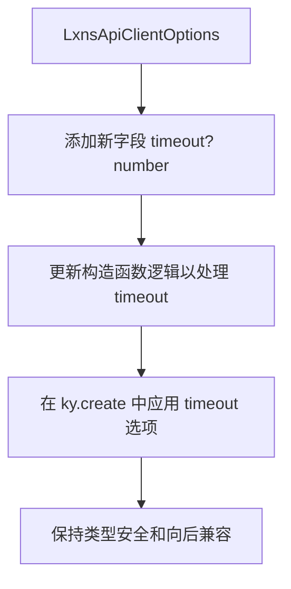

# 配置定制

<cite>
**本文档中引用的文件**
- [LxnsApiCLient.ts](file://src/client/LxnsApiCLient.ts)
- [types.ts](file://src/client/types.ts)
- [public.ts](file://src/apis/maimai/public.ts)
- [dev.ts](file://src/apis/maimai/dev.ts)
- [personal.ts](file://src/apis/maimai/personal.ts)
</cite>

## 目录
1. [简介](#简介)
2. [核心配置项详解](#核心配置项详解)
3. [自定义BaseURL实践](#自定义baseurl实践)
4. [HTTP客户端行为控制](#http客户端行为控制)
5. [多环境动态配置策略](#多环境动态配置策略)
6. [类型安全与接口扩展](#类型安全与接口扩展)
7. [安全注意事项](#安全注意事项)

## 简介
`LxnsApiClient` 是一个轻量级 TypeScript SDK，用于访问 Lxns API 服务。本节重点介绍其构造函数中的配置机制，特别是如何通过 `LxnsApiClientOptions` 接口实现高级自定义功能。SDK 支持灵活的配置选项，包括自定义 API 基础地址、令牌认证以及基于泛型的类型推导，确保开发者能够在不同环境下安全高效地使用 API。

**Section sources**
- [LxnsApiCLient.ts](file://src/client/LxnsApiCLient.ts#L6-L10)

## 核心配置项详解
`LxnsApiClient` 的构造函数接受一个可选的配置对象，该对象实现了 `LxnsApiClientOptions` 接口，包含以下三个关键属性：

- **personalAccessToken**: 用于访问用户个人数据的令牌，启用 `maimai.personal` 命名空间下的 API。
- **devAccessToken**: 开发者访问令牌，启用 `maimai.dev` 命名空间下的管理接口。
- **baseURL**: 自定义 API 服务器的基础 URL，允许对接私有部署或测试环境。

这些配置项在实例化时被合并到默认配置中，并直接影响内部 HTTP 客户端（ky）的行为和可用的 API 子集。



**Diagram sources**
- [LxnsApiCLient.ts](file://src/client/LxnsApiCLient.ts#L15-L80)

**Section sources**
- [LxnsApiCLient.ts](file://src/client/LxnsApiCLient.ts#L6-L10)

## 自定义baseURL实践
通过 `baseURL` 配置项，可以轻松将 SDK 指向不同的 API 服务器，这对于连接私有部署或测试环境至关重要。

### 示例：连接测试环境
```typescript
const testClient = new LxnsApiClient({
  baseURL: "https://test.maimai.lxns.net/api/v0/",
  devAccessToken: "your-test-dev-token"
});
// 所有请求将发送至 https://test.maimai.lxns.net/api/v0/maimai/...
```

### 内部实现机制
当 `baseURL` 被指定时，它会覆盖默认值 `https://maimai.lxns.net/api/v0/`。此值随后被传递给 ky 的 `prefixUrl` 选项，用于构建每个子 API 的完整请求路径：
- `public` 和 `dev` API 使用 `<baseURL>/maimai/` 作为前缀。
- `personal` API 使用 `<baseURL>/user/maimai/` 作为前缀。

这种设计确保了基础地址的统一管理和灵活性。

**Section sources**
- [LxnsApiCLient.ts](file://src/client/LxnsApiCLient.ts#L15-L25)

## HTTP客户端行为控制
虽然 `LxnsApiClient` 本身不直接暴露 ky 的所有配置选项（如超时、重试），但其设计依赖于 ky 强大的默认行为。开发者可以通过理解其内部创建方式来间接影响 HTTP 行为。

### HTTP 客户端创建逻辑
SDK 在内部为每个需要认证的域创建独立的 ky 实例：
- **httpPublic**: 无认证头，仅用于公共 API。
- **httpDev**: 包含 `Authorization` 头，值为 `devAccessToken`。
- **httpPersonal**: 包含 `X-User-Token` 头，值为 `personalAccessToken`。

这些实例的创建完全由传入的令牌决定，体现了“按需启用”的设计原则。

```mermaid
classDiagram
class LxnsApiClient {
+config : LxnsApiClientOptions & { baseURL : string }
+maimai : MaiMaiOf<O>
+constructor(config? : O)
}
class KyInstance {
<<interface>>
+get(url, options) : Promise<any>
+post(url, options) : Promise<any>
+create(options) : KyInstance
}
LxnsApiClient --> "1" KyInstance : 创建 httpPublic
LxnsApiClient --> "0..1" KyInstance : 创建 httpDev
LxnsApiClient --> "0..1" KyInstance : 创建 httpPersonal
LxnsApiClient --> "1" MaimaiPublicApi : 组合
LxnsApiClient --> "0..1" MaimaiDevApi : 组合
LxnsApiClient --> "0..1" MaimaiPersonalApi : 组合
```

**Diagram sources**
- [LxnsApiCLient.ts](file://src/client/LxnsApiCLient.ts#L32-L49)

**Section sources**
- [LxnsApiCLient.ts](file://src/client/LxnsApiCLient.ts#L32-L49)

## 多环境动态配置策略
为了在开发、测试和生产环境中无缝切换，推荐使用环境变量来管理配置。

### 最佳实践示例
```typescript
// config.ts
const getConfig = () => {
  const env = process.env.NODE_ENV || 'development';
  const baseUrls = {
    development: 'https://dev.maimai.lxns.net/api/v0/',
    testing: 'https://test.maimai.lxns.net/api/v0/',
    production: 'https://maimai.lxns.net/api/v0/'
  };

  return {
    baseURL: baseUrls[env],
    // 注意：生产环境应从更安全的来源获取 token
    devAccessToken: process.env.DEV_ACCESS_TOKEN,
    personalAccessToken: process.env.PERSONAL_ACCESS_TOKEN
  };
};

// app.ts
const client = new LxnsApiClient(getConfig());
```

这种方法将配置与代码分离，提高了安全性并简化了部署流程。

**Section sources**
- [LxnsApiCLient.ts](file://src/client/LxnsApiCLient.ts#L15-L25)

## 类型安全与接口扩展
SDK 利用 TypeScript 的泛型和条件类型，实现了高度的类型安全。

### 动态类型推导
`MaiMaiOf<O>` 条件类型根据传入的 `O extends LxnsApiClientOptions` 自动计算 `maimai` 属性的形状。如果提供了 `devAccessToken`，则 `maimai.dev` 可用；否则，该属性不存在，尝试访问将导致编译错误。

### 扩展 ClientConfig 接口
尽管当前 `LxnsApiClientOptions` 接口是固定的，但未来若需支持新字段（如自定义超时），可以直接扩展该接口。由于构造函数使用了泛型 `O extends LxnsApiClientOptions`，任何符合此约束的扩展都将被正确处理。



**Diagram sources**
- [types.ts](file://src/client/types.ts#L28-L32)
- [LxnsApiCLient.ts](file://src/client/LxnsApiCLient.ts#L32-L49)

**Section sources**
- [types.ts](file://src/client/types.ts#L28-L32)

## 安全注意事项
在使用配置项时，必须注意以下安全问题：

1. **避免硬编码敏感信息**：切勿将 `personalAccessToken` 或 `devAccessToken` 直接写在源代码中。始终使用环境变量或安全的密钥管理系统。
2. **限制令牌权限**：根据最小权限原则，为不同环境分配具有适当权限的令牌。
3. **保护 baseURL**：虽然 `baseURL` 通常不是秘密，但在私有部署场景下，也应谨慎处理，防止信息泄露。
4. **环境隔离**：确保测试和开发环境的令牌不会被误用于生产环境，反之亦然。

遵循这些准则可以有效降低安全风险。

**Section sources**
- [LxnsApiCLient.ts](file://src/client/LxnsApiCLient.ts#L15-L80)