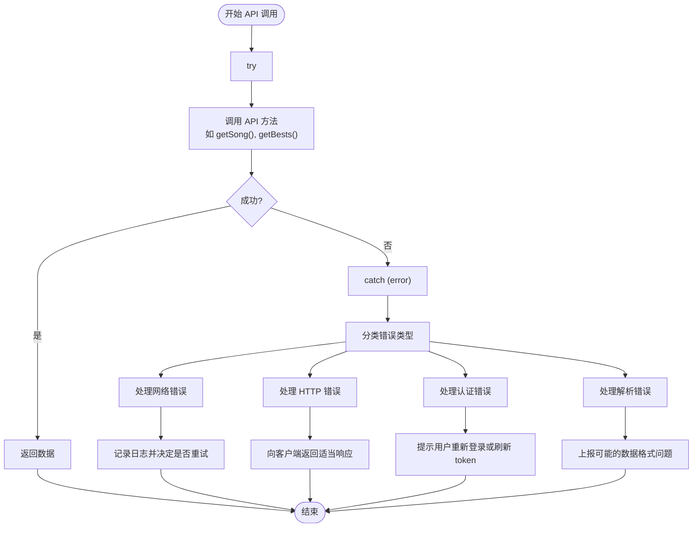
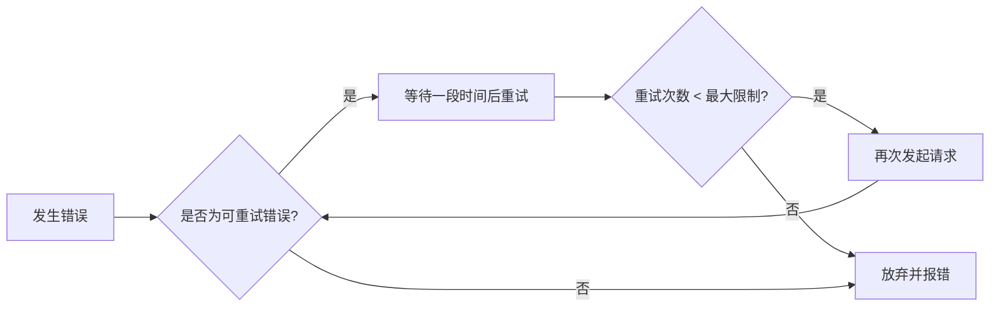
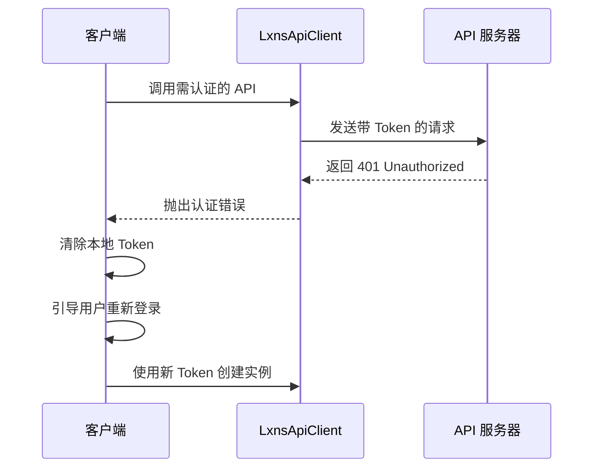

# 错误处理策略

<cite>
**本文档引用的文件**
- [LxnsApiCLient.ts](file://src/client/LxnsApiCLient.ts)
- [public.ts](file://src/apis/maimai/public.ts)
- [dev.ts](file://src/apis/maimai/dev.ts)
- [personal.ts](file://src/apis/maimai/personal.ts)
- [types.ts](file://src/client/types.ts)
</cite>

## 目录
1. [简介](#简介)
2. [错误类型分类](#错误类型分类)
3. [统一错误捕获机制](#统一错误捕获机制)
4. [具体异常场景处理](#具体异常场景处理)
5. [结构化日志记录建议](#结构化日志记录建议)
6. [重试策略与临时性故障判断](#重试策略与临时性故障判断)
7. [认证失效处理流程](#认证失效处理流程)
8. [错误堆栈示例分析](#错误堆栈示例分析)
9. [最佳实践总结](#最佳实践总结)

## 简介
本指南旨在为开发者提供一套完整的错误处理方案，用于应对在使用 `LxnsApiClient` 调用 API 过程中可能遇到的各种异常情况。该 SDK 基于 ky 客户端构建，所有异步操作均返回 Promise，因此所有错误都通过 Promise 拒绝（rejection）的形式传递，SDK 本身不会抛出同步异常。本文将详细说明如何优雅地捕获和分类处理网络请求失败、HTTP 错误响应、数据解析异常以及认证失效等常见问题。

**Section sources**
- [LxnsApiCLient.ts](file://src/client/LxnsApiCLient.ts#L0-L81)

## 错误类型分类
根据实际调用过程中的潜在故障点，可将错误分为以下几类：

- **网络连接错误**：包括超时、DNS 解析失败、连接中断等底层网络问题。
- **HTTP 响应错误**：服务器返回 4xx（客户端错误）或 5xx（服务端错误）状态码。
- **数据解析错误**：响应体格式不符合预期，JSON 解析失败或类型校验不通过。
- **认证失效错误**：`personalAccessToken` 或 `devAccessToken` 无效、过期或权限不足。
- **业务逻辑错误**：API 返回特定错误码或消息，如资源不存在、参数非法等。

这些错误均由 ky 客户端在请求失败时统一以 `HTTPError` 或其他相关异常形式抛出，并最终通过 Promise rejection 传递给调用者。

**Section sources**
- [public.ts](file://src/apis/maimai/public.ts#L0-L103)
- [dev.ts](file://src/apis/maimai/dev.ts#L0-L149)
- [personal.ts](file://src/apis/maimai/personal.ts#L0-L41)

## 统一错误捕获机制
由于所有 API 方法均为异步函数并返回 Promise，必须使用 `try-catch` 结构或 `.catch()` 方法来捕获错误。推荐使用 `try-catch` 以保持代码的可读性和控制流清晰。



**Diagram sources**
- [LxnsApiCLient.ts](file://src/client/LxnsApiCLient.ts#L0-L81)
- [public.ts](file://src/apis/maimai/public.ts#L0-L103)

**Section sources**
- [LxnsApiCLient.ts](file://src/client/LxnsApiCLient.ts#L0-L81)

## 具体异常场景处理
### 网络请求失败（超时、连接中断）
ky 支持配置超时时间。当发生网络层错误（如 `ENOTFOUND`, `ECONNREFUSED`）时，会抛出相应的 Node.js 系统错误或 ky 封装的 `TimeoutError`。

```typescript
try {
  const song = await client.maimai.public.getSong(114);
} catch (error) {
  if (error.name === 'TimeoutError') {
    console.error('请求超时，请检查网络连接');
  } else if (error.code && ['ENOTFOUND', 'ECONNREFUSED'].includes(error.code)) {
    console.error('网络连接失败，请检查服务地址和网络状态');
  }
}
```

### HTTP 错误响应（4xx/5xx）
ky 在收到非 2xx 响应时会自动抛出 `HTTPError`，可通过 `response.status` 获取状态码进行分类处理。

```typescript
import { HTTPError } from 'ky';

try {
  const player = await devClient.maimai.dev.getPlayer(friendCode);
} catch (error) {
  if (error instanceof HTTPError) {
    switch (error.response.status) {
      case 400:
        console.error('请求参数错误');
        break;
      case 401:
      case 403:
        console.error('认证失败或权限不足');
        break;
      case 404:
        console.error('指定资源未找到');
        break;
      case 500:
        console.error('服务器内部错误');
        break;
      default:
        console.error(`HTTP ${error.response.status}: ${error.message}`);
    }
  }
}
```

### 数据解析异常
尽管 ky 使用 `.json()` 方法解析响应体，若服务器返回非 JSON 内容或结构不符，仍可能导致解析失败。此类错误通常表现为 `SyntaxError`。

```typescript
try {
  const list = await client.maimai.public.getSongList();
} catch (error) {
  if (error instanceof SyntaxError) {
    console.error('响应数据格式错误，无法解析 JSON');
  }
}
```

### 认证失效（token 无效或过期）
当使用 `devAccessToken` 或 `personalAccessToken` 发起请求时，若 token 失效，服务器通常返回 401 状态码。应在捕获到 401 错误时提示用户重新获取 token。

```typescript
if (error instanceof HTTPError && error.response.status === 401) {
  console.warn('访问令牌已失效，请更新 personalAccessToken 或 devAccessToken');
  // 触发登录流程或通知用户
}
```

**Section sources**
- [public.ts](file://src/apis/maimai/public.ts#L0-L103)
- [dev.ts](file://src/apis/maimai/dev.ts#L0-L149)
- [personal.ts](file://src/apis/maimai/personal.ts#L0-L41)

## 结构化日志记录建议
为便于调试和监控，建议在捕获错误时记录结构化的上下文信息：

```typescript
function logError(context, error) {
  const logEntry = {
    timestamp: new Date().toISOString(),
    context,
    errorMessage: error.message,
    errorName: error.name,
    stack: error.stack,
    ...(error.response && {
      statusCode: error.response.status,
      url: error.response.url,
    }),
  };
  console.error(JSON.stringify(logEntry, null, 2));
}

// 使用示例
try {
  await client.maimai.public.getSong(999999);
} catch (error) {
  logError({ api: 'getSong', songId: 999999 }, error);
}
```

**Section sources**
- [public.ts](file://src/apis/maimai/public.ts#L0-L103)

## 重试策略与临时性故障判断
对于临时性故障（如网络抖动、503 服务不可用），可实施指数退避重试策略。但应避免对 4xx 错误或明确的业务错误进行重试。



**Diagram sources**
- [LxnsApiCLient.ts](file://src/client/LxnsApiCLient.ts#L0-L81)

**Section sources**
- [LxnsApiCLient.ts](file://src/client/LxnsApiCLient.ts#L0-L81)

## 认证失效处理流程
当检测到认证相关错误（401/403）时，应遵循以下处理流程：



**Diagram sources**
- [LxnsApiCLient.ts](file://src/client/LxnsApiCLient.ts#L0-L81)
- [dev.ts](file://src/apis/maimai/dev.ts#L0-L149)
- [personal.ts](file://src/apis/maimai/personal.ts#L0-L41)

## 错误堆栈示例分析
从实际调用 `getSong` 或 `getBests` 方法中捕获的错误堆栈通常如下所示：

```
HTTPError: Response code 404 (Not Found)
    at onResponse (node_modules/ky/index.js:218:14)
    at process.processTicksAndRejections (node:internal/process/task_queues:95:5)
    at async MaimaiPublicApi.getSong (src/apis/maimai/public.ts:25:12)
    at async main (example.ts:10:20)
```

此堆栈表明：
- 错误由 ky 的 `onResponse` 钩子触发
- 实际调用路径为 `getSong` 方法
- 可据此定位问题发生在公共 API 的歌曲查询环节

**Section sources**
- [public.ts](file://src/apis/maimai/public.ts#L0-L103)
- [dev.ts](file://src/apis/maimai/dev.ts#L0-L149)

## 最佳实践总结
- 所有 API 调用必须包裹在 `try-catch` 中处理 Promise rejection。
- 根据错误类型（网络、HTTP、解析、认证）进行分类处理。
- 使用结构化日志记录错误详情以便排查。
- 对临时性故障实现智能重试，避免对永久性错误重复尝试。
- 在 token 失效时及时通知用户并引导重新认证。
- 不要忽略任何 Promise 的 rejection，防止未捕获异常导致程序崩溃。

**Section sources**
- [LxnsApiCLient.ts](file://src/client/LxnsApiCLient.ts#L0-L81)
- [public.ts](file://src/apis/maimai/public.ts#L0-L103)
- [dev.ts](file://src/apis/maimai/dev.ts#L0-L149)
- [personal.ts](file://src/apis/maimai/personal.ts#L0-L41)